# CLAUDE.md

This file provides guidance to Claude Code (claude.ai/code) when working with code in this repository.

> **编码规范 Skill**: 本项目提供 `.claude/skills/coding-standards.md`，包含注释格式、模块边界、错误处理、数据库设计约定等详细编码规范。Agent
> 在处理本项目代码时自动加载。

> **架构师自动扫描**: 本文件由架构师 Agent (自适应版) 于 2026-06-10 扫描增量更新。完整模块级文档见 `server/*/CLAUDE.md` 与
`web/CLAUDE.md`，扫描元数据见 `.claude/index.json`。

## 变更记录 (Changelog)

| 时间               | 变更                                                                                                                        | 备注                                                                                                                                                                                        |
|------------------|---------------------------------------------------------------------------------------------------------------------------|-------------------------------------------------------------------------------------------------------------------------------------------------------------------------------------------|
| 2026-06-10 18:52 | 新增 `.claude/index.json` 项目扫描索引                                                                                            | 记录模块清单、事件契约、Service 接口、覆盖率与下一步建议                                                                                                                                                          |
| 2026-06-10 18:52 | 新增 14 个模块级 CLAUDE.md                                                                                                      | server 各 Maven 模块 + web 前端总览                                                                                                                                                              |
| 2026-06-10 18:52 | 根级 CLAUDE.md 新增模块结构图 (Mermaid)                                                                                            | 直观表达 Maven 依赖与前后端目录关系                                                                                                                                                                     |
| 2026-06-10 19:08 | 新增 14 个模块级 CLAUDE.md                                                                                                      | service/impl 核心实现类索引 + Redis Stream 消费者 + Groovy 沙箱 + 告警引擎细节                                                                                                                              |
| 2026-06-10 19:08 | 新增 `db/CLAUDE.md`                                                                                                         | 解析 SQL 2.0 全量脚本，59 张表 + Mermaid E-R 图                                                                                                                                                     |
| 2026-06-10 19:08 | `coding-standards.md` 追加 4 节                                                                                              | 第三方库 / 异步线程池 / Redis 规范 / Controller 响应                                                                                                                                                   |
| 2026-06-10 21:20 | **移除 `server/zwei-iot` 兼容空壳模块**                                                                                           | 父 POM + `zwei-admin`/`zwei-monitor` POM + Dockerfile 全部引用清空；Maven 验证 14 模块 BUILD SUCCESS                                                                                                  |
| 2026-06-10 19:08 | **增量补扫 P0-P3**: 6 个核心模块 (alarm/timeseries/device/hazard/video/broker/monitor) 新增"核心实现类索引"小节; 修正多处 `service/impl/` 等子包路径错误 | alarm 5 个 engine 类 + 5 个 service impl + notify 双 SSE; timeseries 4 阶段 + Redis Stream 三段退避; device 设备状态机 + 自注册 7 步; hazard REPEATABLE READ 安全 device_count; broker 10 步鉴权; monitor 8 维度健康分 |
| 2026-06-10 19:08 | 新增 `db/CLAUDE.md` (59 张表清单 + 业务域分组 + E-R 关系图 + 初始化数据)                                                                     | 9 大业务域 + Mermaid `erDiagram` + 关键记录数                                                                                                                                                      |
| 2026-06-24 18:00 | 通知中心 v2: 双 Tab 分页 + 公告详情页 + 菜单暴露 SysNotice | 后端 listTop/recent 接口分页；前端 NoticeDetail.vue + 路由 + 系统管理菜单入口 + 告警跳转失败提示 |
| 2026-06-25 10:00 | **SSE 订阅泄漏修复**: 3 个发布器 25s 心跳 + Nginx 90s 超时 + 前端重连定时器管理 | AlarmStreamPublisher/NoticeStreamPublisher/LogStreamPublisher 新增 @Scheduled heartbeat()；Nginx proxy_read_timeout 60s→90s；layout/index.vue 重连定时器跟踪 + stopped 标志 + onUnmounted 清理；ThreadPoolConfig 新增 TaskScheduler Bean (poolSize=4)；新增 NoticeStreamPublisherTest (3 case) + 扩展 AlarmStreamPublisherTest (2 case)/LogStreamPublisherTest (1 case) |
| 2026-06-14 17:30 | 增强 iot-timeseries 查询能力 | 7 domain + 2 service + 1 controller + IotdbTimeSeriesService 新增 6 方法,ExpressionSpec DSL + 数值范围 + 完整度/趋势 |
| 2026-06-10 19:08 | 模块索引表追加 `db` 行                                                                                                            | MySQL 8.0 全量脚本 + 升级                                                                                                                                                                       |

## Project Overview

**知微 (Zwei)** — 地质灾害监测管理系统 (Geo-Hazard Monitoring & Management System). An IoT platform that collects
real-time sensor data from field devices via MQTT, stores time-series measurements in Apache IoTDB, applies alarm models
for hazard early warning, and provides visualization dashboards with Leaflet maps.

## Tech Stack

| Layer          | Technology                                                       |
|----------------|------------------------------------------------------------------|
| Backend        | Java 17, Spring Boot 4.0.3, MyBatis, Maven                       |
| Frontend       | Vue 3 + TypeScript + Vite, Element Plus 2.6, ECharts 6, Leaflet  |
| Relational DB  | MySQL 8.0 (business data: users, devices, hazard points, alarms) |
| Time-series DB | Apache IoTDB 2.0.2 (sensor measurement data)                     |
| Cache          | Redis 7 (sessions, auth tokens, runtime cache)                   |
| Messaging      | MQTT (embedded mica-mqtt broker) for device communication        |
| Deployment     | Docker Compose, multi-stage Docker builds, Nginx reverse proxy   |

## Development Commands

### Frontend (`web/`)

```bash
cd web
npm run dev       # Start Vite dev server on :5173, proxies /api to :8080
npm run build     # Type-check then production build (outputs to dist/)
npm run preview   # Preview production build locally
```

### Backend (`server/`)

```bash
cd server
mvn clean compile                          # Compile only
mvn clean package -DskipTests              # Build without tests
mvn test                                   # Run all tests
mvn test -pl zwei-iot -Dtest=ClassName     # Run a single test class
```

### Docker (full stack)

```bash
cp .env.example .env    # Then fill in real passwords and secrets
docker compose up -d --build
```

## Architecture

### 模块结构图 (Mermaid)

```mermaid
graph TD
    Root["(根) 知微 / Zwei Geo-Hazard Monitor"] --> Server["server/ (Maven 多模块)"];
    Root --> Web["web/ (Vue 3 + TS)"];
    Root --> Db["db/ (MySQL 脚本 + 升级)"];
    Root --> Docs["docs/ (需求/接口/视图规范)"];

    Server --> SA["zwei-admin<br/>(启动入口 + REST 控制器)"];
    Server --> SF["zwei-framework<br/>(安全/权限/AOP/配置)"];
    Server --> SC["zwei-common<br/>(BaseController/事件契约/工具类)"];
    Server --> SS["zwei-system<br/>(RBAC + 通知公告 notice/)"];
    Server --> SQ["zwei-quartz<br/>(定时任务)"];
    Server --> SL["zwei-log<br/>(审计日志 + SSE + MQTT 消息日志)"];
    Server --> SM["zwei-monitor<br/>(系统/Redis/MQTT/仪表盘)"];
    Server --> SI["zwei-iot-*<br/>(7 个 IoT 子模块)"];

    SI --> IMon["zwei-iot-monitor<br/>(监测字典 - 叶子)"];
    SI --> IDev["zwei-iot-device<br/>(设备+传感器+跨模块接口)"];
    SI --> ITs["zwei-iot-timeseries<br/>(IoTDB 读写 + 解析)"];
    SI --> IBr["zwei-iot-broker<br/>(MQTT 鉴权+ACL)"];
    SI --> IHaz["zwei-iot-hazard<br/>(隐患点+绑定)"];
    SI --> IVid["zwei-iot-video<br/>(视频设备)"];
    SI --> IAlm["zwei-iot-alarm<br/>(告警引擎+Groovy)"];

    Web --> WDash["views/dashboard"];
    Web --> WHolo["views/holo-board"];
    Web --> WBasic["views/basic"];
    Web --> WAlarm["views/alarm"];
    Web --> WReport["views/report"];
    Web --> WIot["views/iot"];
    Web --> WMini["views/miniprogram"];
    Web --> WSys["views/system"];
    Web --> WUser["views/user"];

    click SA "./server/zwei-admin/CLAUDE.md" "查看 Spring Boot 启动入口"
    click SF "./server/zwei-framework/CLAUDE.md" "查看框架层"
    click SC "./server/zwei-common/CLAUDE.md" "查看公共基础"
    click SS "./server/zwei-system/CLAUDE.md" "查看 RBAC + 通知公告"
    click SQ "./server/zwei-quartz/CLAUDE.md" "查看 Quartz 定时任务"
    click SL "./server/zwei-log/CLAUDE.md" "查看审计日志"
    click SM "./server/zwei-monitor/CLAUDE.md" "查看系统监控"
    click IMon "./server/zwei-iot-monitor/CLAUDE.md" "查看 IoT 监测字典"
    click IDev "./server/zwei-iot-device/CLAUDE.md" "查看 IoT 设备"
    click ITs "./server/zwei-iot-timeseries/CLAUDE.md" "查看 IoT 时序"
    click IBr "./server/zwei-iot-broker/CLAUDE.md" "查看 IoT Broker"
    click IHaz "./server/zwei-iot-hazard/CLAUDE.md" "查看 IoT 隐患点"
    click IVid "./server/zwei-iot-video/CLAUDE.md" "查看 IoT 视频设备"
    click IAlm "./server/zwei-iot-alarm/CLAUDE.md" "查看 IoT 告警中心"
    click Web "./web/CLAUDE.md" "查看前端总览"
    click Db "./db/CLAUDE.md" "查看 MySQL 数据库"
```



### 模块索引

| 模块                    | 路径                           | 一句话职责                             | 模块级文档                                               |
|-----------------------|------------------------------|-----------------------------------|-----------------------------------------------------|
| `zwei-admin`          | `server/zwei-admin`          | Spring Boot 启动入口 + REST 控制器总成     | [CLAUDE.md](./server/zwei-admin/CLAUDE.md)          |
| `zwei-common`         | `server/zwei-common`         | 公共基础: BaseController/事件契约/工具类     | [CLAUDE.md](./server/zwei-common/CLAUDE.md)         |
| `zwei-framework`      | `server/zwei-framework`      | 认证/安全/权限/AOP/MyBatis/Redis        | [CLAUDE.md](./server/zwei-framework/CLAUDE.md)      |
| `zwei-system`         | `server/zwei-system`         | RBAC + 通知公告 (含 SSE)               | [CLAUDE.md](./server/zwei-system/CLAUDE.md)         |
| `zwei-quartz`         | `server/zwei-quartz`         | Quartz 定时任务                       | [CLAUDE.md](./server/zwei-quartz/CLAUDE.md)         |
| `zwei-log`            | `server/zwei-log`            | 审计/操作日志 + SSE + MQTT 消息日志         | [CLAUDE.md](./server/zwei-log/CLAUDE.md)            |
| `zwei-monitor`        | `server/zwei-monitor`        | 系统监控: 服务器/Redis/MQTT/仪表盘          | [CLAUDE.md](./server/zwei-monitor/CLAUDE.md)        |
| `zwei-iot-monitor`    | `server/zwei-iot-monitor`    | 监测字典 (category/type/content) — 叶子 | [CLAUDE.md](./server/zwei-iot-monitor/CLAUDE.md)    |
| `zwei-iot-device`     | `server/zwei-iot-device`     | 设备/传感器/注册 + 跨模块接口定义               | [CLAUDE.md](./server/zwei-iot-device/CLAUDE.md)     |
| `zwei-iot-timeseries` | `server/zwei-iot-timeseries` | IoTDB 读写 + 监测数据查询 + 表达式驱动聚合 + 完整度/趋势 | [CLAUDE.md](./server/zwei-iot-timeseries/CLAUDE.md) |
| `zwei-iot-broker`     | `server/zwei-iot-broker`     | MQTT 鉴权/会话/ACL                    | [CLAUDE.md](./server/zwei-iot-broker/CLAUDE.md)     |
| `zwei-iot-hazard`     | `server/zwei-iot-hazard`     | 隐患点/分组/设备绑定                       | [CLAUDE.md](./server/zwei-iot-hazard/CLAUDE.md)     |
| `zwei-iot-video`      | `server/zwei-iot-video`      | 视频设备 + 隐患点关联                      | [CLAUDE.md](./server/zwei-iot-video/CLAUDE.md)      |
| `zwei-iot-alarm`      | `server/zwei-iot-alarm`      | 告警中心: 判据/策略/引擎/分发 (Groovy)        | [CLAUDE.md](./server/zwei-iot-alarm/CLAUDE.md)      |
| 前端总览                  | `web`                        | Vue 3 + TS + Vite + Element Plus  | [CLAUDE.md](./web/CLAUDE.md)                        |
| **数据库**               | `db`                         | **MySQL 8.0 全量脚本 (59 张表) + 升级**   | **[CLAUDE.md](./db/CLAUDE.md)**                     |

### Backend Module Map (Maven multi-module)

```
server/
├── zwei-admin/            Entry point — Spring Boot app, REST controllers
├── zwei-common/           Shared: domain models, annotations (@Log, @RateLimiter, @DataScope),
│                          base classes (BaseController, BaseEntity), AJAX response envelope
├── zwei-framework/        Cross-cutting: JWT auth filter, RBAC security (Spring Security),
│                          MyBatis/Redis/Druid config, AOP aspects, global exception handler
├── zwei-system/           RBAC implementation: users, roles, menus, departments, dicts
│                          └── notice/  通知公告子包（包级隔离，含SSE推送+多通道架构预留）
├── zwei-iot-monitor/      IoT — 监测字典: 监测类型(type) + 监测内容(content)
├── zwei-iot-device/       IoT — 设备全生命周期 + 传感器 + 注册中心 + 跨模块 Service 接口定义
├── zwei-iot-timeseries/   IoT — IoTDB 读写 + MQTT 数据解析 + 监测数据查询
├── zwei-iot-broker/       IoT — MQTT 设备鉴权 + 会话管理 + 发布订阅 ACL
├── zwei-iot-hazard/       IoT — 隐患点管理 + 分组 + 设备/视频设备绑定
├── zwei-iot-video/        IoT — 视频设备管理 + 隐患点关联
├── zwei-iot/              (空壳，保留兼容旧依赖)
├── zwei-iot-alarm/        IoT — 告警中心: 判据/综合策略/引擎/通知分发 (Groovy)
├── zwei-monitor/          System monitoring — unified monitoring API & MQTT broker status
├── zwei-quartz/           Scheduled tasks (quartz job framework)
└── zwei-log/              Audit/operation logging, SSE streaming, MQTT message logs
```

### IoT Modules — Core Business Logic (拆分后)

Previously a single `zwei-iot` module. Now split into 6 independent Maven modules:

| Module                | Package                    | Responsibility                                                                               |
|-----------------------|----------------------------|----------------------------------------------------------------------------------------------|
| `zwei-iot-monitor`    | `com.zwei.iot.monitor`     | Monitor category/type/content CRUD. Pure dictionary, no IoT dependencies.                    |
| `zwei-iot-device`     | `com.zwei.iot.device`      | Device & sensor lifecycle, registration, MQTT auth accounts, cross-module service interfaces |
| `zwei-iot-timeseries` | `com.zwei.iot.timeseries`  | IoTDB read/write, MQTT payload parsing (sys/gb), monitor data query API (latest/page/chart)  |
| `zwei-iot-broker`     | `com.zwei.iot.broker`      | MQTT CONNECT auth, session registry, publish/subscribe ACL, connect/disconnect listeners     |
| `zwei-iot-hazard`     | `com.zwei.iot.hazardpoint` | Hazard point & group CRUD, device/video binding, implements IDeviceHazardRelationService     |
| `zwei-iot-video`      | `com.zwei.iot.video`       | Video device CRUD, hazard point association, implements IVideoDeviceStatService              |
| `zwei-iot-alarm`      | `com.zwei.iot.alarm`       | Alarm center: criteria/strategy/engine/notification (Groovy) — **P0**                        |

**Cross-module dependency rules:**
- `zwei-iot-device` defines all cross-module service interfaces (IDeviceAuthQueryService, IDeviceSensorQueryService, etc.)
- All other IoT modules depend on `zwei-iot-device` only through its service interfaces, never through Mapper directly
- `zwei-iot-monitor` is the leaf module — no IoT dependencies
- `zwei-iot-broker` depends on `zwei-iot-timeseries` (reverse direction; needed to call `MonitorIngestFacade.ingest()`
  from message listener)

### Monitor Module (`zwei-monitor/`) — System & MQTT Monitoring

Unified monitoring layer that wraps the mica-mqtt HTTP API (port 18083) and aggregates server health data:

| Controller                                 | Path Prefix                     | Responsibility                                                                                                |
|--------------------------------------------|---------------------------------|---------------------------------------------------------------------------------------------------------------|
| `MqttStatsController`                      | `/api/v1/monitor/mqtt`          | MQTT server stats, listener config, runtime parameters                                                        |
| `MqttClientController`                     | `/api/v1/monitor/mqtt/clients`  | Connected client list (enriched with device/hazard-point names), client detail (with subscriptions), kick/ban |
| `MonitorOverviewController`                | `/api/v1/monitor`               | Aggregated overview: server health + Redis + online users + MQTT + uptime                                     |
| `DashboardStatController`                  | `/api/v1/monitor/dashboard`     | Dashboard metrics: health score, online/active rates, trend, distribution + /full aggregation                 |
| `MqttMessageLogController` *(in zwei-log)* | `/api/v1/monitor/mqtt/messages` | Real-time device message log query (receive time, clientId, topic, payload, size)                             |

Key infrastructure:

- `MqttHttpApiClient` — wraps mica-mqtt HTTP API calls (stats, clients, subscriptions, kick)
- `MqttSessionEnrichService` — enriches raw MQTT client data with Device/HazardPoint names via `IDeviceQueryService` (
  not via Mapper)
- `MqttHttpApiProperties` — binds `mqtt.server.http-listener.*` config for internal HTTP calls
- `DashboardStatService` — aggregates dashboard metrics via `IDeviceStatService` (Service interface, not Mapper)

**Cross-module dependency rules:**

- `zwei-monitor` depends on `zwei-iot-device` **only through Service interfaces** (`IDeviceStatService`,
  `IDeviceQueryService`), never through Mapper or Domain classes directly.
- IoT modules publish events to `zwei-common` event classes (`MqttMessageReceivedEvent`, `DeviceOnlineEvent`,
  `DeviceOfflineEvent`) — no direct Maven dependency on `zwei-log` for event consumption.
- `zwei-log` listens to common events via `@EventListener`, fully decoupled from source modules.

**Device online status infrastructure:**

- `device_online_status` table — separate from `device` business table, stores real-time online/offline/last_report_at
  as a fast lookup
- `device_online_event_log` table — append-only history of every connect/disconnect with reason
- `DeviceOnlineStatusService` — `@EventListener` on `DeviceOnlineEvent`/`DeviceOfflineEvent`, UPSERTs status + INSERTs
  event log
- `device_sensor.last_report_time` — sensor-level reporting timestamp, updated in
  `MonitorIngestConsumerService.processRecord()` after IoTDB write succeeds

> **Deprecation note:** The legacy monitoring endpoints under `/sys/v1/monitor/*` (ServerController, CacheController,
> SysUserOnlineController) remain operational but are superseded by `/api/v1/monitor/overview`. New development should use
> the `/api/v1/monitor/*` paths.

### Data Flow

```
Field sensors → MQTT (mica-mqtt) → MqttServerMessageListener → MqttDeviceAuthService.hasPublishPermission
    → MonitorIngestFacade.ingest()
    → MonitorTopicParser → MonitorMetadataService → payload parser (sys/gb)
    → MonitorIngestStreamService.enqueue() → Redis Stream (stream:monitor:ingest)
    → MonitorIngestConsumerService (单线程 daemon, 4 阶段处理)
        ─ 阶段1: 幂等去重 (Redis SETNX, dedupe-key 拼接 deviceId:sensorNo:attrCode:dataTime:payloadHash)
        ─ 阶段2: IotdbTimeSeriesService.writePoints (懒建 aligned timeseries, 质量码 INT32 RLE)
        ─ 阶段3: 运维指标回写
            ├─ DeviceOnlineStatusService → device_online_status.last_report_at
            ├─ DeviceSensorService → device_sensor.last_report_time
            └─ DeviceMapper → device.lastReportTime (兼容保留)
        ─ 阶段4: 失败重试 (三段退避 3s/9s/27s) → 死信队列
    → AlarmEvaluationEngine.@EventListener(MonitorDataIngestedEvent)
        → 隐患点专属判据 (优先级 1) → 监测类型兜底 (优先级 2) → 综合策略
        → AlarmRecordServiceImpl.createOrUpdateAlarm (去重 + 状态机)
        → AlarmNotifier (分发) + AlarmStreamPublisher (SSE)
```

### Frontend Structure

```
web/src/
├── api/          # Per-domain API modules (device, hazardPoint, monitorData, sensor, etc.)
├── views/        # Page components organized by feature area:
│   ├── dashboard/       # Home dashboard
│   ├── holo-board/      # Comprehensive views (map overlay, alarm, operation, custom)
│   ├── basic/           # Hazard points, monitor types, device/video management
│   ├── alarm/           # Real-time alarms, criteria, notification, disposal
│   ├── report/          # Reports, query center, data analysis, large screen
│   ├── iot/             # Alarm engine, data parsing
│   ├── miniprogram/     # Mini-program facing views
│   ├── system/          # Organization, identity, permission, logs, settings, notice
│   └── user/            # User profile
├── layout/       # Main layout shell with sidebar navigation
├── router/       # Vue Router config — all routes except /login require token auth
└── utils/
    ├── request.ts  # Axios wrapper — base URL /api/v1, auto-attaches Bearer token, handles 401
    └── auth.ts     # Auth failure handler
```

### API Convention

- All REST endpoints are under `/api/v1/`
- Standard response envelope: `{ code, msg, data }` pattern from BaseController/AjaxResult
- JWT Bearer token auth (via `Authorization` header), validated by `JwtAuthenticationTokenFilter`
- Anonymous access controlled by `@Anonymous` annotation on controller methods
- Vite dev server proxies `/api` → `http://127.0.0.1:8080`

### Key Config Files

| File                             | Purpose                                                                      |
|----------------------------------|------------------------------------------------------------------------------|
| `docker-compose.yml`             | Full stack orchestration with health checks and log rotation                 |
| `web/nginx.conf`                 | Production Nginx — SPA fallback, API proxy to backend, SSE/WebSocket support |
| `server/pom.xml`                 | Parent POM with all dependency versions and module declarations              |
| `.env.example`                   | Required environment variables template                                      |
| `db/geo_hazard_monitor_v2.0.sql` | MySQL 8.0.42 full dump (59 tables, 3099 lines)                               |
| `db/CLAUDE.md`                   | Database ER + table inventory + initialization data                          |

## Database Notes

- MySQL 8.0.42, charset `utf8mb4_0900_ai_ci`, all tables InnoDB
- 59 tables grouped into 9 business domains (alarm/device/hazard/monitor/log/report/video/sys_/sensor)
- 物理外键**仅** `device_hazard_point` / `video_device_hazard_point` 两张表保留；其余由应用层 Service 维护
  （见 `.claude/skills/coding-standards.md` 第六节）
- **逻辑删除**统一 `del_flag` 列 (0-正常 1-删除)，不物理 DELETE
- IoTDB stores time-series data — paths `root.{database}.d{deviceId}.s{sensorNo}` with auto-created aligned timeseries
  (DOUBLE+GORILLA for values, INT32+RLE for quality codes)
- 升级脚本目录 `db/upgrade/` 当前**不存在**；如需新增请按版本号命名

## Shared Events (`zwei-common`)

Event classes in `com.zwei.common.event` serve as contracts between modules without direct Maven dependencies:

| Event                      | Publisher                                                   | Consumer                                           |
|----------------------------|-------------------------------------------------------------|----------------------------------------------------|
| `MqttMessageReceivedEvent` | zwei-iot (MqttServerMessageListener)                        | zwei-log (MqttMessageLogService)                   |
| `DeviceOnlineEvent`        | zwei-iot (MqttDeviceAuthService, MqttConnectStatusListener) | zwei-iot (DeviceOnlineStatusService)               |
| `DeviceOfflineEvent`       | zwei-iot (MqttConnectStatusListener)                        | zwei-iot (DeviceOnlineStatusService)               |
| `NoticeCreatedEvent`       | zwei-system (SysNoticeServiceImpl)                          | zwei-system (NoticeStreamPublisher → SSE)          |
| `AlarmTriggeredEvent`      | zwei-iot-alarm (AlarmEvaluationEngine)                      | alarm (AlarmNotifier + AlarmStreamPublisher → SSE) |
| `MonitorDataIngestedEvent` | zwei-iot-timeseries (MonitorIngestConsumerService)          | alarm (AlarmEvaluationEngine) + future analytics   |

## Notification Module (`zwei-system/notice/`)

Package-isolated at `com.zwei.system.notice.*` (16 files renamed from `zwei-system`, zero business code changes):

| Subpackage      | Contents                                                                                |
|-----------------|-----------------------------------------------------------------------------------------|
| `domain/`       | SysNotice, SysNoticeRead                                                                |
| `mapper/`       | SysNoticeMapper, SysNoticeReadMapper                                                    |
| `service/`      | ISysNoticeService, ISysNoticeReadService, NoticeStreamPublisher (SSE)                   |
| `service/impl/` | SysNoticeServiceImpl, SysNoticeReadServiceImpl                                          |
| `notify/`       | INotifyChannel, NotifyChannelDispatcher, NotifySendRequest (multi-channel architecture) |

Controllers in `zwei-admin/web/controller/system/notice/`:

- `SysNoticeController` — CRUD + read/unread status at `/api/v1/system/notice/*`
- `NoticeStreamController` — SSE endpoint at `/api/v1/system/notice/stream`

Frontend: `web/src/api/notice.ts` + `web/src/layout/index.vue` (notification bell with real data + SSE real-time push).

## Security Model

- RBAC with 4 permission levels: menu, button, data scope, API
- `@DataScope` annotation filters SQL queries by user's department hierarchy (up to 5 levels)
- `@RateLimiter` / `@RepeatSubmit` for abuse prevention
- `@Sensitive` annotation for automatic data masking in JSON serialization
- Admin user (user_id=1) gets `*:*:*` wildcard permission; all others derive permissions from `sys_role_menu` + `sys_menu.perms`

### Permission Convention

All `@PreAuthorize` annotations follow the pattern `module:entity:action` (e.g. `system:user:list`).

**Permissions added by zwei-monitor / log hardening:**

| String | Purpose |
|--------|---------|
| `monitor:overview:list` | System monitoring overview dashboard |
| `monitor:mqtt:list` | MQTT broker stats, clients, listeners, message logs |
| `monitor:mqtt:kick` | Kick/ban MQTT clients |
| `monitor:operlog:list` | Query operation/auth/runtime logs and SSE stream |
| `common:file:upload` | File upload (single + batch) |
| `common:file:query` | File download |

**Permission management endpoints (SysMenuController):**

| Method | Path | Purpose |
|--------|------|---------|
| `GET` | `/api/v1/menus/permission-coverage` | Compare `@PreAuthorize` annotations vs `sys_menu.perms` — returns `{ codePerms, dbPerms, missingInDb }` |
| `POST` | `/api/v1/menus/batch-register` | Bulk register missing permissions as menu entries under parent_id=2 (系统监控) |

Use these to identify and fix permission gaps after adding new `@PreAuthorize` annotations.

<!-- superpowers-zh:begin (do not edit between these markers) -->
# Superpowers-ZH 中文增强版

本项目已安装 superpowers-zh 技能框架（20 个 skills）。

## 核心规则

1. **收到任务时，先检查是否有匹配的 skill** — 哪怕只有 1% 的可能性也要检查
2. **设计先于编码** — 收到功能需求时，先用 brainstorming skill 做需求分析
3. **测试先于实现** — 写代码前先写测试（TDD）
4. **验证先于完成** — 声称完成前必须运行验证命令

## 可用 Skills

Skills 位于 `.claude/skills/` 目录，每个 skill 有独立的 `SKILL.md` 文件。

- **brainstorming**: 在任何创造性工作之前必须使用此技能——创建功能、构建组件、添加功能或修改行为。在实现之前先探索用户意图、需求和设计。
- **chinese-code-review**: 中文 review 沟通参考——话术模板、分级标注（必须修复/建议修改/仅供参考）、国内团队常见反模式应对。仅在用户显式 /chinese-code-review 时调用，不要根据上下文自动触发。
- **chinese-commit-conventions**: 中文 commit 与 changelog 配置参考——Conventional Commits 中文适配、commitlint/husky/commitizen 中文模板、conventional-changelog 中文配置。仅在用户显式 /chinese-commit-conventions 时调用，不要根据上下文自动触发。
- **chinese-documentation**: 中文文档排版参考——中英文空格、全半角标点、术语保留、链接格式、中文文案排版指北约定。仅在用户显式 /chinese-documentation 时调用，不要根据上下文自动触发。
- **chinese-git-workflow**: 国内 Git 平台配置参考——Gitee、Coding.net、极狐 GitLab、CNB 的 SSH/HTTPS/凭据/CI 接入差异与镜像同步配置。仅在用户显式 /chinese-git-workflow 时调用，不要根据上下文自动触发。
- **dispatching-parallel-agents**: 当面对 2 个以上可以独立进行、无共享状态或顺序依赖的任务时使用
- **executing-plans**: 当你有一份书面实现计划需要在单独的会话中执行，并设有审查检查点时使用
- **finishing-a-development-branch**: 当实现完成、所有测试通过、需要决定如何集成工作时使用——通过提供合并、PR 或清理等结构化选项来引导开发工作的收尾
- **mcp-builder**: MCP 服务器构建方法论 — 系统化构建生产级 MCP 工具，让 AI 助手连接外部能力
- **receiving-code-review**: 收到代码审查反馈后、实施建议之前使用，尤其当反馈不明确或技术上有疑问时——需要技术严谨性和验证，而非敷衍附和或盲目执行
- **requesting-code-review**: 完成任务、实现重要功能或合并前使用，用于验证工作成果是否符合要求
- **subagent-driven-development**: 当在当前会话中执行包含独立任务的实现计划时使用
- **systematic-debugging**: 遇到任何 bug、测试失败或异常行为时使用，在提出修复方案之前执行
- **test-driven-development**: 在实现任何功能或修复 bug 时使用，在编写实现代码之前
- **using-git-worktrees**: 当需要开始与当前工作区隔离的功能开发，或在执行实现计划之前使用——通过原生工具或 git worktree 回退机制确保隔离工作区存在
- **using-superpowers**: 在开始任何对话时使用——确立如何查找和使用技能，要求在任何响应（包括澄清性问题）之前调用 Skill 工具
- **verification-before-completion**: 在宣称工作完成、已修复或测试通过之前使用，在提交或创建 PR 之前——必须运行验证命令并确认输出后才能声称成功；始终用证据支撑断言
- **workflow-runner**: 在 Claude Code / OpenClaw / Cursor 中直接运行 agency-orchestrator YAML 工作流——无需 API key，使用当前会话的 LLM 作为执行引擎。当用户提供 .yaml 工作流文件或要求多角色协作完成任务时触发。
- **writing-plans**: 当你有规格说明或需求用于多步骤任务时使用，在动手写代码之前
- **writing-skills**: 当创建新技能、编辑现有技能或在部署前验证技能是否有效时使用

## 如何使用

当任务匹配某个 skill 时，使用 `Skill` 工具加载对应 skill 并严格遵循其流程。绝不要用 Read 工具读取 SKILL.md 文件。

如果你认为哪怕只有 1% 的可能性某个 skill 适用于你正在做的事情，你必须调用该 skill 检查。
<!-- superpowers-zh:end -->
