[根目录](../CLAUDE.md) > [db](.) > **数据库 (MySQL 8.0)**

# db — MySQL 8.0 全量脚本 + 升级

> 面包屑: [根目录](../CLAUDE.md) > [db](.) > **数据库**

## 概述

本目录包含项目完整的 MySQL 8.0 数据库脚本与升级文件。

| 文件                            | 用途                                               |
|-------------------------------|--------------------------------------------------|
| `geo_hazard_monitor_v2.0.sql` | **全量初始化脚本** (mysqldump 输出, 3099 行, 59 张表 + 完整数据) |
| `api_20260525.md`             | 数据库相关 API 备忘                                     |
| `CLAUDE.md`                   | 本文档                                              |

> **升级脚本目录**: `db/upgrade/`，按版本号递增执行（如 `v2.1-parser-module.sql`、`v2.9-sensor-code-device-unique.sql`）。

## 数据库基本信息

| 属性   | 值                                            |
|------|----------------------------------------------|
| 数据库名 | `geo_hazard_monitor`                         |
| 版本   | MySQL **8.0.42**                             |
| 字符集  | `utf8mb4`                                    |
| 排序规则 | `utf8mb4_0900_ai_ci`                         |
| 存储引擎 | **InnoDB** (全部表)                             |
| 时间字段 | `datetime` (秒级) / `datetime(3)` (毫秒级, 用于日志表) |
| 主键策略 | `bigint NOT NULL AUTO_INCREMENT`             |

## 业务领域分组

数据库表按业务域分为以下 9 大类 (按表名前缀聚合):

| 域                | 表数  | 典型表                                                                                                                                                | 说明                              |
|------------------|-----|----------------------------------------------------------------------------------------------------------------------------------------------------|---------------------------------|
| **alarm** 告警     | 8   | `alarm_criteria` / `alarm_record` / `alarm_strategy`                                                                                               | 告警判据/记录/策略/分发/通知                |
| **device** 设备    | 7   | `device` / `device_sensor` / `device_hazard_point`                                                                                                 | 设备主表/传感器/属性/绑定/在线状态             |
| **hazard** 隐患点   | 2   | `hazard_point` / `hazard_point_group`                                                                                                              | 隐患点 + 分组                        |
| **monitor** 监测字典 | 2   | `monitor_type` / `monitor_content`                                                                                                                 | 类型/内容 (2 级字典)                   |
| **log** 日志       | 4   | `log_auth_record` / `log_operation_record` / `log_runtime_record` / `log_stream_checkpoint`                                                        | 认证/操作/运行/流断点                    |
| **report** 报告    | 2   | `report_template` / `report_record`                                                                                                                | 报告模板 + 生成记录                     |
| **video** 视频     | 2   | `video_device` / `video_device_hazard_point`                                                                                                       | 视频设备 + 隐患点绑定                    |
| **sys_** 系统 RBAC | 13  | `sys_user` / `sys_role` / `sys_menu` / `sys_dept` / `sys_dict_*` / `sys_notice_*` / `sys_notify_*` / `sys_organization` / `sys_config` / `sys_job` | 用户/角色/权限/部门/字典/通知/任务等           |
| **sensor** 传感器属性 | 1   | `sensor_attribute`                                                                                                                                 | 设备传感器的属性字典 (与 device_sensor 关联) |
| **业务辅助**         | 17+ | 跨域 Mapper 表                                                                                                                                        | 已在 alarm/device/hazard 域中列出     |

## 完整表清单 (59 张)

### 告警域 (8)

| 表名                            | 中文名         | 字段数 | 关键索引                                                                  | 说明                             |
|-------------------------------|-------------|-----|-----------------------------------------------------------------------|--------------------------------|
| `alarm_criteria`              | 告警判据表       | 16  | idx_criteria_type/content/hp/enabled/del                              | 单指标多级阈值                        |
| `alarm_criteria_log`          | 告警判据变更日志    | 8   | idx_criteria_log_cid(criteriaId,version)                              | CREATE/UPDATE/DELETE/TOGGLE 审计 |
| `alarm_dispatch_rule`         | 告警分发规则表     | 14  | idx_dispatch_hp/enabled                                               | 按隐患点/告警等级/类型匹配                 |
| `alarm_notification`          | 告警通知记录表     | 12  | idx_notif_alarm/recipient/status/channel                              | SYSTEM/SMS/EMAIL 多通道           |
| `alarm_record`                | 告警记录表       | 22  | idx_record_hp/level/status/type/criteria/strategy/device/trigger_time | 状态机: 1待处理/2处理中/3已销警/4误报        |
| `alarm_record_log`            | 告警状态变更日志    | 9   | idx_alarm_log_aid(alarmId,createTime)                                 | fromStatus→toStatus 流转         |
| `alarm_strategy`              | 综合告警策略表     | 18  | idx_strategy_mode/enabled/del                                         | Groovy 脚本 + REALTIME/CRON 触发   |
| `alarm_strategy_hazard_point` | 综合策略-隐患点绑定表 | 6   | uk_strategy_hp(strategyId,hazardPointId)                              | UNIQUE 约束                      |

### 设备域 (7)

| 表名                        | 中文名       | 字段数 | 关键索引                                                           | 说明                       |
|---------------------------|-----------|-----|----------------------------------------------------------------|--------------------------|
| `device`                  | 设备表       | 26  | uk_device_code / uk_device_auth_username                       | 设备主表                     |
| `device_auth_log`         | 设备认证日志    | 8   | idx_device_auth_log_device(deviceId,createTime)                | 鉴权成功/失败审计                |
| `device_hazard_point`     | 设备隐患点关联表  | 10  | uk_device_hazard_point + FK fk_dhp_device/fk_dhp_hp            | 唯一绑定                     |
| `device_online_event_log` | 设备上下线事件日志 | 8   | idx_device_time / idx_event_time                               | ONLINE/OFFLINE/HEARTBEAT |
| `device_online_status`    | 设备在线状态    | 9   | device_id UNIQUE / idx_status / idx_last_report                | 实时在线/离线                  |
| `device_registration_log` | 设备注册日志    | 12  | uk_device_register_request_id                                  | requestId 幂等             |
| `device_sensor`           | 传感器表      | 16  | uk_device_sensor (device_id, sensor_code) / idx_device_sensor_device_id/type_id/status/del | 设备内唯一编码 (v2.9 从全局唯一改为设备内唯一) |
| `device_status_log`       | 设备状态日志表   | 12  | idx_device_status_log_device_id/create_time                    | 报修/修复/停用/恢复历史            |
| `sensor_attribute`        | 传感器属性表    | 14  | uk_sensor_attr_code(sensorId,attrCode)                         | 属性级字典                    |

### 隐患点域 (2)

| 表名                   | 中文名    | 字段数 | 关键索引                                                             | 说明                             |
|----------------------|--------|-----|------------------------------------------------------------------|--------------------------------|
| `hazard_point`       | 隐患点表   | 16  | uk_hazard_point_code / idx_hazard_point_group_id/status/del_flag | 含 boundaryCoords JSON (多边形+走向) |
| `hazard_point_group` | 隐患点分组表 | 12  | uk_hazard_group_code                                             | 排序 + 启用                        |

### 监测字典域 (3)

| 表名                | 中文名   | 字段数 | 关键索引                                                  | 说明               |
|-------------------|-------|-----|-------------------------------------------------------|------------------|
| `monitor_content` | 监测内容表 | 15  | uk_monitor_content_code(monitor_type_id,code) / idx_monitor_content_type_id | 类型内唯一编码 (v2.10 从全局唯一改为类型内唯一) |
| `monitor_type`    | 监测类型表 | 12  | uk_monitor_type_code                                  | 雨量监测/位移监测/...    |

### 日志域 (4)

| 表名                      | 中文名     | 字段数 | 关键索引                                                       | 说明                           |
|-------------------------|---------|-----|------------------------------------------------------------|------------------------------|
| `log_auth_record`       | 认证日志    | 19  | uk_log_auth_event_id + 5 个时间/user/status/trace 索引          | datetime(3) 毫秒精度             |
| `log_operation_record`  | 接口调用日志  | 24  | uk_log_operation_event_id + 5 个复合索引                        | 含 requestParams/responseBody |
| `log_runtime_record`    | 运行日志    | 16  | uk_log_runtime_event_id + 5 个时间/level/logger/host/trace 索引 | 含 stackTrace mediumtext      |
| `log_stream_checkpoint` | 日志流断点记录 | 6   | uk_log_stream_checkpoint(subscriberKey,logType)            | SSE 流断点续传                    |

### 报告域 (2)

| 表名                | 中文名   | 字段数 | 关键索引                                                   | 说明                 |
|-------------------|-------|-----|--------------------------------------------------------|--------------------|
| `report_record`   | 报告记录表 | 12  | idx_report_record_template_id/hp_id/report_date/status | 生成中/已生成/生成失败       |
| `report_template` | 报告模板表 | 12  | uk_report_template_code                                | 日报/周报/月报/季报/年报/自定义 |

### 视频域 (2)

| 表名                          | 中文名      | 字段数 | 关键索引                                                       | 说明                |
|-----------------------------|----------|-----|------------------------------------------------------------|-------------------|
| `video_device`              | 视频设备表    | 16  | uk_video_device_code / idx_video_device_status/del_flag    | 状态 0=离线 1=在线 2=故障 |
| `video_device_hazard_point` | 视频-隐患点绑定 | 10  | uk_video_device_hazard_point + FK fk_vdhp_video/fk_vdhp_hp | 经纬度 CHECK 约束      |

### 系统 RBAC 域 (13)

| 表名                    | 中文名       | 字段数 | 关键索引                                                | 说明                              |
|-----------------------|-----------|-----|-----------------------------------------------------|---------------------------------|
| `sys_config`          | 参数配置表     | 10  | uk_config_key                                       | 系统参数 (含 sys_focus_area GeoJSON) |
| `sys_dept`            | 部门表       | 16  | uk_sys_dept_code / idx_sys_dept_parent_id/status    | 5 级 (level + ancestors)         |
| `sys_dict_data`       | 字典数据表     | 12  | (无显式索引)                                             | dict_type + dict_value 复合       |
| `sys_dict_type`       | 字典类型表     | 8   | dict_type UNIQUE                                    | 15 种字典                          |
| `sys_job`             | 定时任务调度表   | 12  | PK(job_id, job_name, job_group)                     | 复合主键                            |
| `sys_job_log`         | 定时任务调度日志表 | 10  | (PK)                                                | 执行历史                            |
| `sys_menu`            | 菜单权限表     | 18  | (PK)                                                | menu_type M/C/F                 |
| `sys_notice`          | 通知公告表     | 10  | (PK)                                                | longblob 公告内容                   |
| `sys_notice_read`     | 公告已读记录表   | 5   | uk_user_notice(userId,noticeId)                     | 已读追踪                            |
| `sys_notify_instance` | 通知实例      | 11  | idx_type_time / idx_source                          | 通知全生命周期                         |
| `sys_notify_target`   | 通知目标      | 11  | idx_user_status / idx_instance / idx_channel_status | in_app/email/sms                |
| `sys_notify_template` | 通知模板      | 14  | template_code UNIQUE                                | 含 {变量} 替换                       |
| `sys_organization`    | 组织架构表     | 17  | uk_sys_org_code                                     | 独立于 sys_dept                    |
| `sys_post`            | 岗位信息表     | 10  | (PK)                                                | 4 个初始岗位                         |
| `sys_role`            | 角色信息表     | 14  | uk_sys_role_role_name / uk_sys_role_role_key        | dataScope 1-4                   |
| `sys_role_dept`       | 角色和部门关联表  | 2   | (PK)                                                | dataScope=2 角色-部门映射             |
| `sys_role_menu`       | 角色和菜单关联表  | 2   | (PK)                                                | RBAC 核心                         |
| `sys_user`            | 用户信息表     | 19  | uk_sys_user_user_name / phonenumber / email         | BCrypt 密码                       |
| `sys_user_post`       | 用户与岗位关联表  | 2   | (PK)                                                | 多对多                             |
| `sys_user_role`       | 用户和角色关联表  | 2   | (PK)                                                | 多对多                             |

> **统计**: 严格意义上 sys_* 域 19 张表（含 job_log 等）；上述计数与全表 59 张表存在交叉，重在按业务语义分组。

## 核心实体 E-R 关系图

```mermaid
erDiagram
    sys_user ||--o{ sys_user_role : "拥有"
    sys_role ||--o{ sys_user_role : "分配"
    sys_role ||--o{ sys_role_menu : "授权"
    sys_role ||--o{ sys_role_dept : "数据权限"
    sys_menu ||--o{ sys_role_menu : "被授权"
    sys_dept ||--o{ sys_role_dept : "数据范围"
    sys_dept ||--o{ sys_user : "归属"
    sys_post ||--o{ sys_user_post : "担任"
    sys_user ||--o{ sys_user_post : "兼任"
    sys_organization ||--o{ sys_organization : "父子层级"
    sys_dict_type ||--o{ sys_dict_data : "包含"
    sys_config ||--|| sys_user : "运行时配置"

    monitor_type ||--o{ monitor_content : "包含"
    monitor_content ||--o{ sensor_attribute : "对应"
    monitor_type ||--o{ device_sensor : "选用"
    monitor_content ||--o{ sensor_attribute : "实例化"

    hazard_point_group ||--o{ hazard_point : "分组"
    hazard_point ||--o{ device_hazard_point : "绑定设备"
    device ||--o{ device_hazard_point : "归属"
    hazard_point ||--o{ video_device_hazard_point : "绑定视频"
    video_device ||--o{ video_device_hazard_point : "归属"
    hazard_point ||--o{ device : "经纬度引用"

    device ||--|| device_online_status : "实时状态"
    device ||--o{ device_online_event_log : "历史事件"
    device ||--o{ device_auth_log : "鉴权历史"
    device ||--o{ device_status_log : "维修历史"
    device ||--o{ device_registration_log : "注册历史"
    device ||--o{ device_sensor : "包含"
    device_sensor ||--o{ sensor_attribute : "属性"

    alarm_criteria ||--o{ alarm_criteria_log : "变更历史"
    alarm_strategy ||--o{ alarm_strategy_hazard_point : "适用隐患点"
    hazard_point ||--o{ alarm_strategy_hazard_point : "被绑定"
    alarm_criteria ||--o{ alarm_record : "触发"
    alarm_strategy ||--o{ alarm_record : "触发"
    hazard_point ||--o{ alarm_record : "所属"
    device ||--o{ alarm_record : "触发设备"
    alarm_record ||--o{ alarm_record_log : "状态变更"
    alarm_record ||--o{ alarm_notification : "派发"
    alarm_dispatch_rule ||--o{ alarm_notification : "匹配"

    report_template ||--o{ report_record : "生成"
    hazard_point ||--o{ report_record : "所属"
    sys_notice ||--o{ sys_notice_read : "已读"
    sys_notify_template ||--o{ sys_notify_instance : "实例化"
    sys_notify_instance ||--o{ sys_notify_target : "下发"
    sys_user ||--o{ sys_notify_target : "接收"

    log_stream_checkpoint }o--|| sys_user : "SSE 断点"
```



> **注**: 图中 `||--o{` 表示"一对多"，`}o--o{` 表示"多对多"，`}o--||` 表示"多对一"。*
*所有外键约束只有 `device_hazard_point` / `video_device_hazard_point` 两张表使用**，其余通过应用层 Service 维护（参考下文"
> 数据库设计原则"）。

## 初始化数据摘要

### 用户与角色 (sys_*)

| 表               | 记录数  | 关键记录                                                         |
|-----------------|------|--------------------------------------------------------------|
| `sys_user`      | 2    | admin (user_id=1, 部门 103) / ry (user_id=2, 部门 105)           |
| `sys_role`      | 4    | 超级管理员(admin) / 普通角色(common) / 监测管理员(MONITOR) / 操作员(OPERATOR) |
| `sys_user_role` | 3    | admin→admin+common / ry→common                               |
| `sys_menu`      | 100+ | 系统管理/监控/工具/基础业务/告警管理 (含 100+ 按钮权限)                           |
| `sys_dept`      | 10   | 若依科技 → 深圳/长沙分公司 → 研发/市场/测试/财务/运维部门                           |
| `sys_dict_type` | 15   | 用户性别/菜单状态/告警等级/设备状态/隐患点状态/通知类型/...                           |
| `sys_config`    | 13   | 主框架皮肤/初始密码/日志清理/系统关注范围 GeoJSON                               |

### 隐患点 (hazard_*)

| 表                    | 记录数 | 关键记录                                                  |
|----------------------|-----|-------------------------------------------------------|
| `hazard_point`       | 14  | 龙泉寺崩塌/清溪乡泥石流/工业园区地面沉降/顺发铁矿边坡/... (含多边形 boundary JSON) |
| `hazard_point_group` | 9   | 崩塌/滑坡/泥石流/沉降/边坡监测组 + 4 个测试组                           |

### 设备与传感器 (device_*)

| 表                  | 记录数 | 关键记录                                   |
|--------------------|-----|----------------------------------------|
| `device`           | 1   | test_device_001 (auth=NZMX40/FSg4n5Z2) |
| `device_sensor`    | 1   | test_sensor_001 (雨量监测)                 |
| `sensor_attribute` | 2   | rainfall_hour / rainfall_day           |

### 监测字典 (monitor_*)

| 表                  | 记录数 | 关键记录                                              |
|--------------------|-----|---------------------------------------------------|
| `monitor_type`     | 9   | JCLX001-008 + 1 测试                                |
| `monitor_content`  | 13  | rainfall_hour/rainfall_day/displacement_x/y/z/... |

### 告警 (alarm_*)

| 表                             | 记录数 | 关键记录                                                                    |
|-------------------------------|-----|-------------------------------------------------------------------------|
| `alarm_criteria`              | 9   | 小时雨量通用判据/龙泉寺位移联合判据/...                                                  |
| `alarm_criteria_log`          | 13  | CREATE/UPDATE/TOGGLE 审计                                                 |
| `alarm_strategy`              | 3   | 清溪乡暴雨泥石流综合预警 (REALTIME) / 龙泉寺位移综合评估 (CRON 0 0 8 * * ?) / 温度异常跳变检测 (已停用) |
| `alarm_strategy_hazard_point` | 3   | 策略-隐患点绑定                                                                |
| `alarm_dispatch_rule`         | 4   | 全局默认/全局黄色及以上/龙泉寺高等级/清溪乡泥石流专项                                            |
| `alarm_notification`          | 10  | SMS/SYSTEM 混合, 含 1 条失败案例                                                |
| `alarm_record`                | 8   | 含 1 条误报/1 条处理中/3 条已销警/3 条待处理                                            |

### 视频 (video_*)

| 表              | 记录数 | 关键记录                           |
|----------------|-----|--------------------------------|
| `video_device` | 1   | test_video_device001 (HLS 样例流) |

### 任务 (sys_job)

| 表         | 记录数 | 关键记录                                     |
|-----------|-----|------------------------------------------|
| `sys_job` | 4   | 系统默认(无参/有参/多参) + 日志30天自动清理 (0 0 3 * * ?) |

## 数据库设计原则

> **节选自 `.claude/skills/coding-standards.md` 第六节**

1. **逻辑删除** — 全量使用 `del_flag` 列 (`tinyint DEFAULT '0'`, 0-正常 1-删除)，不物理 DELETE
2. **不使用数据库外键约束** — FK 无法感知 `del_flag=0` 过滤，导致僵尸引用。*
   *仅 `device_hazard_point` / `video_device_hazard_point` 保留 FK**（业务核心绑定）
3. **应用层 Service 校验参照完整性** — `DeviceHazardPointServiceImpl.ensureHazardPointExists()` 等
4. **字段命名** — 区分语义（`sensor_code` 全局唯一 vs `sensor_no` 设备内唯一 vs `sensor_id` 主键）
5. **唯一约束 + 重写列值** — 删除时通过将唯一列改写为 `#DEL#xxx` 后缀释放

## 升级脚本说明

**当前状态**: `db/upgrade/` 目录不存在。

如需新增升级脚本，建议:

1. 创建 `db/upgrade/v2.1.0.sql` / `v2.2.0.sql` (按版本号倒序执行)
2. 脚本内容只包含 `ALTER TABLE` / `CREATE TABLE` / `INSERT` (字典/菜单新增项)
3. 不修改历史脚本 — 已有部署实例无法重放
4. 在 `db/CLAUDE.md` 维护变更日志

## 验证查询

```sql
-- 表数量统计
SELECT COUNT(*) AS table_count
FROM information_schema.tables
WHERE table_schema = 'geo_hazard_monitor';

-- 表大小 TOP 10
SELECT table_name, table_rows,
       ROUND(data_length/1024/1024, 2) AS data_mb,
       ROUND(index_length/1024/1024, 2) AS index_mb
FROM information_schema.tables
WHERE table_schema = 'geo_hazard_monitor'
ORDER BY data_length DESC
LIMIT 10;
```

## 相关文件清单

- `geo_hazard_monitor_v2.0.sql` (3099 行, mysqldump 输出)
- `upgrade/v2.9-sensor-code-device-unique.sql` (传感器编号约束：全局唯一 → 设备内唯一)
- `upgrade/v2.10-monitor-content-code-type-unique.sql` (监测内容编码约束：全局唯一 → 监测类型内唯一)
- `api_20260525.md` (数据库相关 API 备忘)
- `CLAUDE.md` (本文档)

## 变更记录 (Changelog)

| 时间               | 变更                                                                 |
|------------------|--------------------------------------------------------------------|
| 2026-06-10 19:08 | 首次创建 db/CLAUDE.md (架构师增量扫描) — 提取 59 张表清单、按业务域分组、核心 E-R 关系图、初始化数据摘要 |
| 2026-06-23 | **v2.9 升级**: `device_sensor.sensor_code` 唯一约束从全局唯一 `uk_device_sensor_code` 改为设备内唯一 `uk_device_sensor (device_id, sensor_code)`；下游 IoTDB 路径与告警引擎已使用 (deviceId, sensorCode) 复合键，无影响 |
| 2026-06-23 | **v2.10 升级**: `monitor_content.code` 唯一约束从全局唯一 `uk_monitor_content_code` 改为类型内唯一 `uk_monitor_content_code (monitor_type_id, code)`；下游告警用 PK 匹配、同步按 typeId 过滤，无影响 |
