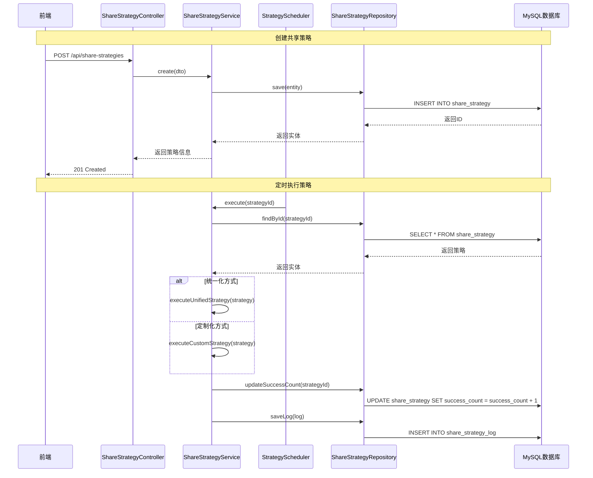
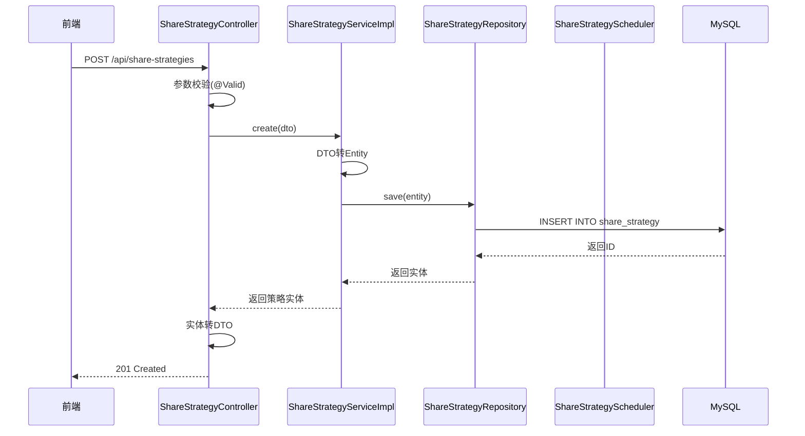
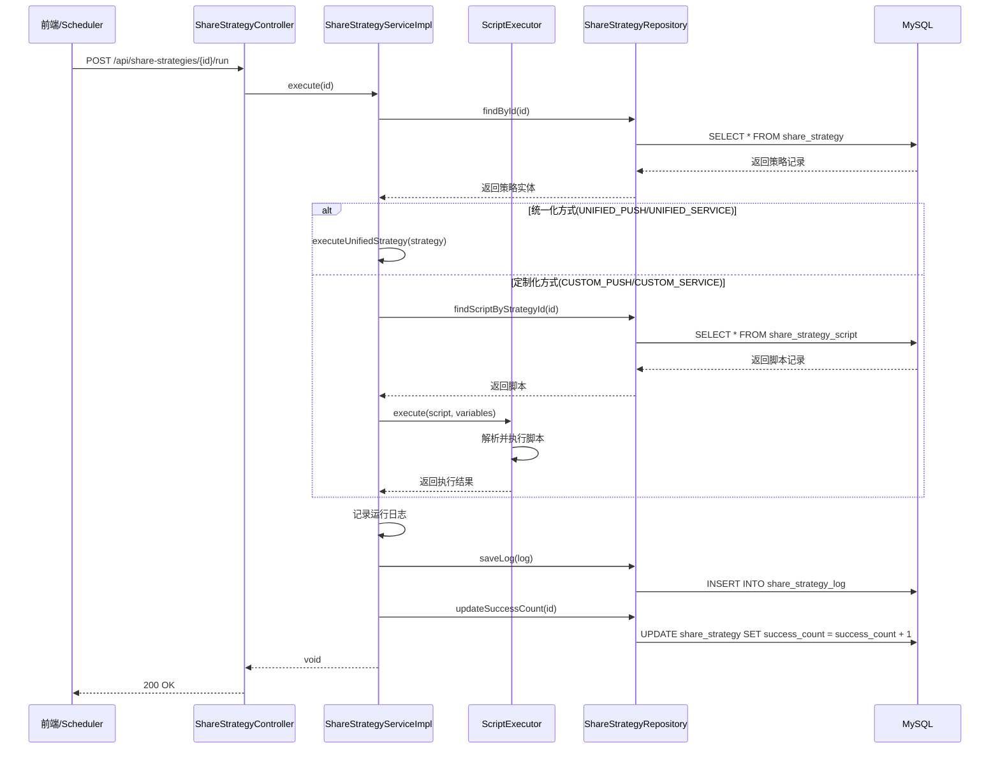
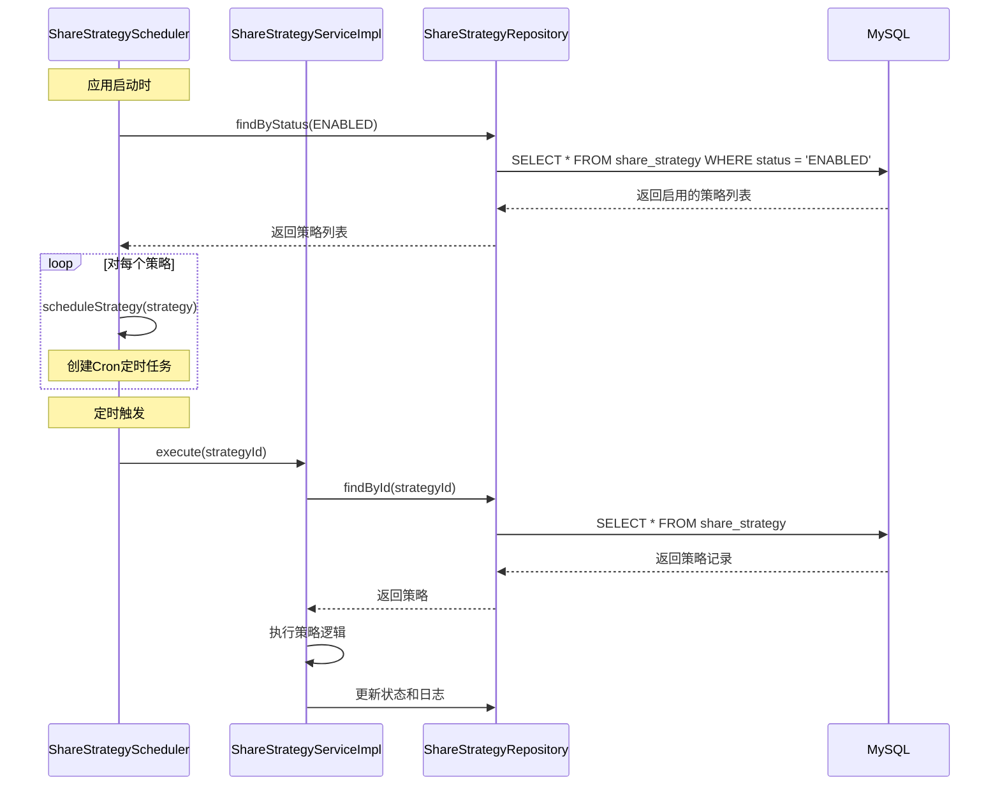

# 数据共享模块设计方案

## 1. 需求分析

### 1.1 业务背景

共享策略模块用于管理系统成果数据向第三方系统、上下级单位等进行数据分享。通过数据推送或接口服务等方式，实现基础数据、成果数据的安全有效分享。

### 1.2 功能需求

| 需求编号 | 需求描述 | 来源 |
| :--- | :--- | :--- |
| REQ-001 | 支持四种分享方式：统一化数据推送、定制化数据推送、统一化数据服务、定制化数据服务 | 需求第2点 |
| REQ-002 | 统一化方式固定数据项和分享模型，不支持个性化定制 | 需求第2点 |
| REQ-003 | 定制化方式支持可视化(Blockly)编程，灵活定制分享模型 | 需求第2点、第4点 |
| REQ-004 | 支持查看策略运行日志 | 需求第3点 |
| REQ-005 | 定制化策略提供预置工具方法（监听/订阅、查询设备/厂商/隐患点、调用属性/算法、存储数据、数据输出等） | 需求第4点 |
| REQ-006 | 支持设置共享数据范围（隐患点分组、隐患点、厂商、设备） | 需求第5点 |

### 1.3 数据字段需求

| 字段名 | 说明 | 来源 |
| :--- | :--- | :--- |
| 编号 | 策略唯一标识 | 需求第1点 |
| 名称 | 策略名称 | 需求第1点 |
| 描述 | 策略描述 | 需求第1点 |
| 方式 | 分享方式（四种） | 需求第1点、第2点 |
| 地址 | IP或IP+端口 | 需求第1点 |
| 主题 | MQTT主题或API路径 | 需求第1点 |
| 账号 | 认证账号 | 需求第1点 |
| 密码 | 认证密码 | 需求第1点 |
| 其他参数 | 扩展参数 | 需求第1点 |
| 范围 | 数据范围类型和ID列表 | 需求第1点、第5点 |
| 频率 | Cron表达式 | 需求第1点 |
| 状态 | 启用/停用 | 需求第1点 |
| 成功分享量 | 累计成功次数 | 需求第1点 |
| 创建时间 | 创建时间戳 | 需求第1点 |
| 更新时间 | 更新时间戳 | 需求第1点 |

---

## 2. 后端系统技术方案

### 2.1 技术选型

| 分类 | 技术 | 版本 | 说明 |
| :--- | :--- | :--- | :--- |
| 语言 | Java | 21 | LTS 版本，性能稳定 |
| 框架 | Spring Boot | 3.2.x | 社区成熟，生态完善 |
| ORM | MyBatis Plus | 3.5.x | 简化CRUD操作 |
| 数据库 | MySQL | 8.0+ | 稳定可靠，社区活跃 |
| 定时任务 | Spring Scheduler | - | Spring内置，轻量级 |
| JSON处理 | Jackson | 2.15+ | Spring Boot默认 |

### 2.2 关键设计

#### 2.2.1 架构设计

- **架构风格**: 集成式单体应用 (Integrated Monolith)
- **模块划分**:
  - `controller`：对外 REST API 控制层
  - `service`：业务逻辑层
  - `repository`：数据访问层（MyBatis Plus）
  - `entity`：数据库实体模型
  - `dto`：数据传输对象（请求/响应）
  - `enums`：枚举类型定义
  - `config`：配置类
  - `scheduler`：定时任务调度

- **核心流程图 (Mermaid)**:



#### 2.2.2 目录结构

```plaintext
backend/
  └── src/
      └── main/
          ├── java/
          │   └── com/example/app/
          │       ├── controller/
          │       │   └── ShareStrategyController.java      # [新增] REST API控制层
          │       ├── service/
          │       │   ├── ShareStrategyService.java         # [新增] 业务接口
          │       │   └── impl/
          │       │       └── ShareStrategyServiceImpl.java # [新增] 业务实现
          │       ├── repository/
          │       │   └── ShareStrategyRepository.java     # [新增] 数据访问层
          │       ├── entity/
          │       │   ├── ShareStrategy.java               # [新增] 策略实体
          │       │   ├── ShareStrategyLog.java            # [新增] 日志实体
          │       │   └── ShareStrategyScript.java         # [新增] 脚本实体
          │       ├── dto/
          │       │   ├── request/
          │       │   │   ├── ShareStrategyCreateDTO.java  # [新增] 创建请求DTO
          │       │   │   ├── ShareStrategyUpdateDTO.java  # [新增] 更新请求DTO
          │       │   │   ├── ShareStrategyQueryDTO.java   # [新增] 查询请求DTO
          │       │   │   └── ShareStrategyScriptDTO.java  # [新增] 脚本请求DTO
          │       │   └── response/
          │       │       └── ShareStrategyResponseDTO.java # [新增] 响应DTO
          │       ├── enums/
          │       │   ├── ShareMethod.java                 # [新增] 分享方式枚举
          │       │   ├── ScopeType.java                   # [新增] 范围类型枚举
          │       │   ├── StrategyStatus.java              # [新增] 策略状态枚举
          │       │   └── RunStatus.java                   # [新增] 运行状态枚举
          │       ├── config/
          │       │   └── ScheduleConfig.java              # [新增] 定时任务配置
          │       ├── scheduler/
          │       │   └── ShareStrategyScheduler.java      # [新增] 策略调度器
          │       ├── executor/
          │       │   ├── ScriptExecutor.java              # [新增] 脚本执行器
          │       │   └── tools/
          │       │       ├── SubscribeTool.java           # [新增] 订阅工具
          │       │       ├── QueryDeviceTool.java         # [新增] 查询设备工具
          │       │       ├── QueryVendorTool.java         # [新增] 查询厂商工具
          │       │       ├── QueryHazardPointTool.java    # [新增] 查询隐患点工具
          │       │       ├── GetPropertyTool.java         # [新增] 获取属性工具
          │       │       ├── AlgorithmTool.java           # [新增] 算法工具
          │       │       ├── StoreDataTool.java           # [新增] 存储数据工具
          │       │       ├── OutputTool.java              # [新增] 数据输出工具
          │       │       ├── DelayTool.java               # [新增] 延时工具
          │       │       └── LogTool.java                 # [新增] 日志工具
          │       └── Application.java                     # 启动类(已有)
          └── resources/
              ├── application.yml                          # 配置文件(已有)
              └── mapper/
                  ├── ShareStrategyMapper.xml              # [新增] 策略Mapper
                  ├── ShareStrategyLogMapper.xml           # [新增] 日志Mapper
                  └── ShareStrategyScriptMapper.xml       # [新增] 脚本Mapper
```

**目录职责说明**:

| 目录 | 职责 | 状态 |
| :--- | :--- | :--- |
| `controller` | 处理HTTP请求，参数校验，调用Service层 | 新增 |
| `service` | 业务逻辑处理，事务管理 | 新增 |
| `repository` | 数据库访问，继承MyBatis Plus | 新增 |
| `entity` | 数据库表映射实体 | 新增 |
| `dto` | 请求/响应数据传输对象 | 新增 |
| `enums` | 枚举类型定义 | 新增 |
| `config` | Spring配置类 | 新增 |
| `scheduler` | 定时任务调度 | 新增 |
| `executor` | 脚本执行引擎和工具方法 | 新增 |

#### 2.2.3 关键类与方法设计

##### 2.2.3.1 Controller层

**ShareStrategyController.java**

| 方法名 | 功能说明 | 参数 | 返回值 | 失败返回 | 所属文件 |
| :--- | :--- | :--- | :--- | :--- | :--- |
| `findPage` | 分页查询策略列表 | `ShareStrategyQueryDTO query, Pageable pageable` | `Page<ShareStrategyResponseDTO>` | `400 Bad Request` | `controller/ShareStrategyController.java` |
| `findById` | 根据ID查询策略详情 | `Long id` | `ShareStrategyResponseDTO` | `404 Not Found` | `controller/ShareStrategyController.java` |
| `create` | 创建共享策略 | `ShareStrategyCreateDTO dto` | `ShareStrategyResponseDTO` | `400 Bad Request` | `controller/ShareStrategyController.java` |
| `update` | 更新共享策略 | `Long id, ShareStrategyUpdateDTO dto` | `ShareStrategyResponseDTO` | `404 Not Found` | `controller/ShareStrategyController.java` |
| `delete` | 删除共享策略 | `Long id` | `void` | `404 Not Found` | `controller/ShareStrategyController.java` |
| `changeStatus` | 切换策略状态 | `Long id, StrategyStatus status` | `ShareStrategyResponseDTO` | `404 Not Found` | `controller/ShareStrategyController.java` |
| `execute` | 立即执行策略 | `Long id` | `void` | `404 Not Found` | `controller/ShareStrategyController.java` |
| `findLogs` | 查询策略运行日志 | `Long id, Pageable pageable` | `Page<ShareStrategyLog>` | `404 Not Found` | `controller/ShareStrategyController.java` |
| `getScript` | 获取策略脚本 | `Long id` | `ShareStrategyScript` | `404 Not Found` | `controller/ShareStrategyController.java` |
| `saveScript` | 保存策略脚本 | `Long id, ShareStrategyScriptDTO dto` | `void` | `404 Not Found` | `controller/ShareStrategyController.java` |

##### 2.2.3.2 Service层

**ShareStrategyService.java（接口）**

| 方法名 | 功能说明 | 参数 | 返回值 | 所属文件 |
| :--- | :--- | :--- | :--- | :--- |
| `findPage` | 分页查询策略 | `ShareStrategyQueryDTO query, Pageable pageable` | `Page<ShareStrategy>` | `service/ShareStrategyService.java` |
| `findById` | 根据ID查询 | `Long id` | `ShareStrategy` | `service/ShareStrategyService.java` |
| `create` | 创建策略 | `ShareStrategyCreateDTO dto` | `ShareStrategy` | `service/ShareStrategyService.java` |
| `update` | 更新策略 | `Long id, ShareStrategyUpdateDTO dto` | `ShareStrategy` | `service/ShareStrategyService.java` |
| `delete` | 删除策略 | `Long id` | `void` | `service/ShareStrategyService.java` |
| `changeStatus` | 切换状态 | `Long id, StrategyStatus status` | `ShareStrategy` | `service/ShareStrategyService.java` |
| `execute` | 执行策略 | `Long id` | `void` | `service/ShareStrategyService.java` |
| `findLogs` | 查询日志 | `Long strategyId, Pageable pageable` | `Page<ShareStrategyLog>` | `service/ShareStrategyService.java` |
| `getScript` | 获取脚本 | `Long strategyId` | `ShareStrategyScript` | `service/ShareStrategyService.java` |
| `saveScript` | 保存脚本 | `Long strategyId, ShareStrategyScriptDTO dto` | `void` | `service/ShareStrategyService.java` |

##### 2.2.3.3 Executor层

**ScriptExecutor.java**

| 方法名 | 功能说明 | 参数 | 返回值 | 所属文件 |
| :--- | :--- | :--- | :--- | :--- |
| `execute` | 执行脚本 | `String script, Map<String, Object> variables` | `ExecutionResult` | `executor/ScriptExecutor.java` |
| `registerTool` | 注册工具方法 | `String name, ToolFunction tool` | `void` | `executor/ScriptExecutor.java` |

**ToolFunction接口**

| 方法名 | 功能说明 | 参数 | 返回值 | 所属文件 |
| :--- | :--- | :--- | :--- | :--- |
| `execute` | 执行工具方法 | `Map<String, Object> params` | `Object` | `executor/tools/ToolFunction.java` |

##### 2.2.3.4 Scheduler层

**ShareStrategyScheduler.java**

| 方法名 | 功能说明 | 参数 | 返回值 | 所属文件 |
| :--- | :--- | :--- | :--- | :--- |
| `init` | 初始化调度器 | 无 | `void` | `scheduler/ShareStrategyScheduler.java` |
| `scheduleStrategy` | 调度指定策略 | `ShareStrategy strategy` | `void` | `scheduler/ShareStrategyScheduler.java` |
| `rescheduleStrategy` | 重新调度策略 | `Long strategyId` | `void` | `scheduler/ShareStrategyScheduler.java` |

#### 2.2.4 数据库与数据结构设计

##### 2.2.4.1 数据库表设计

**表1: share_strategy（共享策略表）**

| 字段名 | 类型 | 约束 | 说明 | 溯源 |
| :--- | :--- | :--- | :--- | :--- |
| `id` | BIGINT | PRIMARY KEY, AUTO_INCREMENT | 主键ID | 系统生成 |
| `code` | VARCHAR(50) | NOT NULL, UNIQUE | 策略编号 | REQ-006(编号) |
| `name` | VARCHAR(100) | NOT NULL | 策略名称 | REQ-006(名称) |
| `description` | VARCHAR(500) | NULL | 策略描述 | REQ-006(描述) |
| `method` | VARCHAR(30) | NOT NULL | 分享方式 | REQ-001, REQ-006(方式) |
| `address` | VARCHAR(200) | NOT NULL | 目标地址(IP:端口) | REQ-006(地址) |
| `topic` | VARCHAR(200) | NULL | MQTT主题或API路径 | REQ-006(主题) |
| `username` | VARCHAR(100) | NULL | 认证账号 | REQ-006(账号) |
| `password` | VARCHAR(100) | NULL | 认证密码(加密存储) | REQ-006(密码) |
| `params` | TEXT | NULL | 其他参数(JSON格式) | REQ-006(其他参数) |
| `scope_type` | VARCHAR(30) | NOT NULL | 数据范围类型 | REQ-005, REQ-006(范围) |
| `scope_ids` | TEXT | NULL | 范围ID列表(JSON格式) | REQ-005, REQ-006(范围) |
| `cron` | VARCHAR(50) | NOT NULL | Cron表达式 | REQ-006(频率) |
| `status` | VARCHAR(20) | NOT NULL, DEFAULT 'DISABLED' | 策略状态 | REQ-006(状态) |
| `success_count` | INT | DEFAULT 0 | 成功分享量 | REQ-006(成功分享量) |
| `last_run_time` | DATETIME | NULL | 最近运行时间 | 系统维护 |
| `last_run_status` | VARCHAR(20) | NULL | 最近运行状态 | 系统维护 |
| `create_time` | DATETIME | NOT NULL, DEFAULT CURRENT_TIMESTAMP | 创建时间 | REQ-006(创建时间) |
| `update_time` | DATETIME | NOT NULL, DEFAULT CURRENT_TIMESTAMP ON UPDATE CURRENT_TIMESTAMP | 更新时间 | REQ-006(更新时间) |

**表2: share_strategy_log（共享策略运行日志表）**

| 字段名 | 类型 | 约束 | 说明 | 溯源 |
| :--- | :--- | :--- | :--- | :--- |
| `id` | BIGINT | PRIMARY KEY, AUTO_INCREMENT | 主键ID | 系统生成 |
| `strategy_id` | BIGINT | NOT NULL, INDEX | 关联策略ID | REQ-003 |
| `run_time` | DATETIME | NOT NULL | 运行时间 | REQ-003 |
| `status` | VARCHAR(20) | NOT NULL | 运行状态(SUCCESS/ERROR/TIMEOUT) | REQ-003 |
| `message` | TEXT | NULL | 运行信息/错误信息 | REQ-003 |
| `data_count` | INT | DEFAULT 0 | 处理数据条数 | REQ-003 |
| `duration` | INT | NULL | 耗时(毫秒) | REQ-003 |
| `create_time` | DATETIME | NOT NULL, DEFAULT CURRENT_TIMESTAMP | 创建时间 | 系统维护 |

**表3: share_strategy_script（共享策略脚本表）**

| 字段名 | 类型 | 约束 | 说明 | 溯源 |
| :--- | :--- | :--- | :--- | :--- |
| `id` | BIGINT | PRIMARY KEY, AUTO_INCREMENT | 主键ID | 系统生成 |
| `strategy_id` | BIGINT | NOT NULL, UNIQUE, INDEX | 关联策略ID | REQ-003, REQ-004 |
| `script` | LONGTEXT | NULL | Blockly脚本内容(JSON) | REQ-003, REQ-004 |
| `variables` | TEXT | NULL | 变量配置(JSON) | REQ-004 |
| `create_time` | DATETIME | NOT NULL, DEFAULT CURRENT_TIMESTAMP | 创建时间 | 系统维护 |
| `update_time` | DATETIME | NOT NULL, DEFAULT CURRENT_TIMESTAMP ON UPDATE CURRENT_TIMESTAMP | 更新时间 | 系统维护 |

##### 2.2.4.2 索引设计

| 表名 | 索引名 | 字段 | 类型 | 说明 |
| :--- | :--- | :--- | :--- | :--- |
| `share_strategy` | `uk_code` | `code` | UNIQUE | 策略编号唯一索引 |
| `share_strategy` | `idx_status` | `status` | NORMAL | 状态索引，优化状态筛选 |
| `share_strategy` | `idx_method` | `method` | NORMAL | 分享方式索引 |
| `share_strategy_log` | `idx_strategy_id` | `strategy_id` | NORMAL | 策略ID索引，优化日志查询 |
| `share_strategy_log` | `idx_run_time` | `run_time` | NORMAL | 运行时间索引，优化时间范围查询 |
| `share_strategy_script` | `uk_strategy_id` | `strategy_id` | UNIQUE | 策略ID唯一索引 |

##### 2.2.4.3 实体类字段设计

**ShareStrategy.java**

| 字段名 | Java类型 | 数据库映射 | 说明 | 约束 | 所属文件 |
| :--- | :--- | :--- | :--- | :--- | :--- |
| `id` | Long | `id` | 主键 | @Id, @GeneratedValue | `entity/ShareStrategy.java` |
| `code` | String | `code` | 策略编号 | @NotBlank, @Size(max=50) | `entity/ShareStrategy.java` |
| `name` | String | `name` | 策略名称 | @NotBlank, @Size(max=100) | `entity/ShareStrategy.java` |
| `description` | String | `description` | 策略描述 | @Size(max=500) | `entity/ShareStrategy.java` |
| `method` | ShareMethod | `method` | 分享方式 | @NotNull | `entity/ShareStrategy.java` |
| `address` | String | `address` | 目标地址 | @NotBlank, @Size(max=200) | `entity/ShareStrategy.java` |
| `topic` | String | `topic` | MQTT主题 | @Size(max=200) | `entity/ShareStrategy.java` |
| `username` | String | `username` | 认证账号 | @Size(max=100) | `entity/ShareStrategy.java` |
| `password` | String | `password` | 认证密码 | @Size(max=100) | `entity/ShareStrategy.java` |
| `params` | Map<String, Object> | `params` | 其他参数 | @Type(type="json") | `entity/ShareStrategy.java` |
| `scopeType` | ScopeType | `scope_type` | 数据范围类型 | @NotNull | `entity/ShareStrategy.java` |
| `scopeIds` | List<Long> | `scope_ids` | 范围ID列表 | @Type(type="json") | `entity/ShareStrategy.java` |
| `cron` | String | `cron` | Cron表达式 | @NotBlank, @Size(max=50) | `entity/ShareStrategy.java` |
| `status` | StrategyStatus | `status` | 策略状态 | @NotNull | `entity/ShareStrategy.java` |
| `successCount` | Integer | `success_count` | 成功分享量 | @Min(0) | `entity/ShareStrategy.java` |
| `lastRunTime` | LocalDateTime | `last_run_time` | 最近运行时间 | - | `entity/ShareStrategy.java` |
| `lastRunStatus` | RunStatus | `last_run_status` | 最近运行状态 | - | `entity/ShareStrategy.java` |
| `createTime` | LocalDateTime | `create_time` | 创建时间 | @CreatedDate | `entity/ShareStrategy.java` |
| `updateTime` | LocalDateTime | `update_time` | 更新时间 | @LastModifiedDate | `entity/ShareStrategy.java` |

**ShareStrategyLog.java**

| 字段名 | Java类型 | 数据库映射 | 说明 | 约束 | 所属文件 |
| :--- | :--- | :--- | :--- | :--- | :--- |
| `id` | Long | `id` | 主键 | @Id, @GeneratedValue | `entity/ShareStrategyLog.java` |
| `strategyId` | Long | `strategy_id` | 策略ID | @NotNull | `entity/ShareStrategyLog.java` |
| `runTime` | LocalDateTime | `run_time` | 运行时间 | @NotNull | `entity/ShareStrategyLog.java` |
| `status` | RunStatus | `status` | 运行状态 | @NotNull | `entity/ShareStrategyLog.java` |
| `message` | String | `message` | 运行信息 | - | `entity/ShareStrategyLog.java` |
| `dataCount` | Integer | `data_count` | 数据条数 | @Min(0) | `entity/ShareStrategyLog.java` |
| `duration` | Integer | `duration` | 耗时(毫秒) | @Min(0) | `entity/ShareStrategyLog.java` |
| `createTime` | LocalDateTime | `create_time` | 创建时间 | @CreatedDate | `entity/ShareStrategyLog.java` |

**ShareStrategyScript.java**

| 字段名 | Java类型 | 数据库映射 | 说明 | 约束 | 所属文件 |
| :--- | :--- | :--- | :--- | :--- | :--- |
| `id` | Long | `id` | 主键 | @Id, @GeneratedValue | `entity/ShareStrategyScript.java` |
| `strategyId` | Long | `strategy_id` | 策略ID | @NotNull | `entity/ShareStrategyScript.java` |
| `script` | String | `script` | 脚本内容 | - | `entity/ShareStrategyScript.java` |
| `variables` | Map<String, Object> | `variables` | 变量配置 | @Type(type="json") | `entity/ShareStrategyScript.java` |
| `createTime` | LocalDateTime | `create_time` | 创建时间 | @CreatedDate | `entity/ShareStrategyScript.java` |
| `updateTime` | LocalDateTime | `update_time` | 更新时间 | @LastModifiedDate | `entity/ShareStrategyScript.java` |

##### 2.2.4.4 DTO字段设计

**ShareStrategyCreateDTO.java**

| 字段名 | Java类型 | 说明 | 约束 | 所属文件 |
| :--- | :--- | :--- | :--- | :--- |
| `code` | String | 策略编号 | @NotBlank, @Size(max=50) | `dto/request/ShareStrategyCreateDTO.java` |
| `name` | String | 策略名称 | @NotBlank, @Size(max=100) | `dto/request/ShareStrategyCreateDTO.java` |
| `description` | String | 策略描述 | @Size(max=500) | `dto/request/ShareStrategyCreateDTO.java` |
| `method` | ShareMethod | 分享方式 | @NotNull | `dto/request/ShareStrategyCreateDTO.java` |
| `address` | String | 目标地址 | @NotBlank, @Size(max=200) | `dto/request/ShareStrategyCreateDTO.java` |
| `topic` | String | MQTT主题 | @Size(max=200) | `dto/request/ShareStrategyCreateDTO.java` |
| `username` | String | 认证账号 | @Size(max=100) | `dto/request/ShareStrategyCreateDTO.java` |
| `password` | String | 认证密码 | @Size(max=100) | `dto/request/ShareStrategyCreateDTO.java` |
| `params` | Map<String, Object> | 其他参数 | - | `dto/request/ShareStrategyCreateDTO.java` |
| `scopeType` | ScopeType | 数据范围类型 | @NotNull | `dto/request/ShareStrategyCreateDTO.java` |
| `scopeIds` | List<Long> | 范围ID列表 | - | `dto/request/ShareStrategyCreateDTO.java` |
| `cron` | String | Cron表达式 | @NotBlank, @Size(max=50) | `dto/request/ShareStrategyCreateDTO.java` |

**ShareStrategyUpdateDTO.java**

| 字段名 | Java类型 | 说明 | 约束 | 所属文件 |
| :--- | :--- | :--- | :--- | :--- |
| `name` | String | 策略名称 | @Size(max=100) | `dto/request/ShareStrategyUpdateDTO.java` |
| `description` | String | 策略描述 | @Size(max=500) | `dto/request/ShareStrategyUpdateDTO.java` |
| `method` | ShareMethod | 分享方式 | - | `dto/request/ShareStrategyUpdateDTO.java` |
| `address` | String | 目标地址 | @Size(max=200) | `dto/request/ShareStrategyUpdateDTO.java` |
| `topic` | String | MQTT主题 | @Size(max=200) | `dto/request/ShareStrategyUpdateDTO.java` |
| `username` | String | 认证账号 | @Size(max=100) | `dto/request/ShareStrategyUpdateDTO.java` |
| `password` | String | 认证密码 | @Size(max=100) | `dto/request/ShareStrategyUpdateDTO.java` |
| `params` | Map<String, Object> | 其他参数 | - | `dto/request/ShareStrategyUpdateDTO.java` |
| `scopeType` | ScopeType | 数据范围类型 | - | `dto/request/ShareStrategyUpdateDTO.java` |
| `scopeIds` | List<Long> | 范围ID列表 | - | `dto/request/ShareStrategyUpdateDTO.java` |
| `cron` | String | Cron表达式 | @Size(max=50) | `dto/request/ShareStrategyUpdateDTO.java` |

**ShareStrategyQueryDTO.java**

| 字段名 | Java类型 | 说明 | 约束 | 所属文件 |
| :--- | :--- | :--- | :--- | :--- |
| `name` | String | 策略名称(模糊查询) | @Size(max=100) | `dto/request/ShareStrategyQueryDTO.java` |
| `status` | StrategyStatus | 策略状态 | - | `dto/request/ShareStrategyQueryDTO.java` |
| `method` | ShareMethod | 分享方式 | - | `dto/request/ShareStrategyQueryDTO.java` |

**ShareStrategyScriptDTO.java**

| 字段名 | Java类型 | 说明 | 约束 | 所属文件 |
| :--- | :--- | :--- | :--- | :--- |
| `script` | String | 脚本内容 | - | `dto/request/ShareStrategyScriptDTO.java` |
| `variables` | Map<String, Object> | 变量配置 | - | `dto/request/ShareStrategyScriptDTO.java` |

**ShareStrategyResponseDTO.java**

| 字段名 | Java类型 | 说明 | 所属文件 |
| :--- | :--- | :--- | :--- |
| `id` | Long | 主键ID | `dto/response/ShareStrategyResponseDTO.java` |
| `code` | String | 策略编号 | `dto/response/ShareStrategyResponseDTO.java` |
| `name` | String | 策略名称 | `dto/response/ShareStrategyResponseDTO.java` |
| `description` | String | 策略描述 | `dto/response/ShareStrategyResponseDTO.java` |
| `method` | ShareMethod | 分享方式 | `dto/response/ShareStrategyResponseDTO.java` |
| `methodLabel` | String | 分享方式标签 | `dto/response/ShareStrategyResponseDTO.java` |
| `address` | String | 目标地址 | `dto/response/ShareStrategyResponseDTO.java` |
| `topic` | String | MQTT主题 | `dto/response/ShareStrategyResponseDTO.java` |
| `scopeType` | ScopeType | 数据范围类型 | `dto/response/ShareStrategyResponseDTO.java` |
| `scopeTypeLabel` | String | 数据范围标签 | `dto/response/ShareStrategyResponseDTO.java` |
| `cron` | String | Cron表达式 | `dto/response/ShareStrategyResponseDTO.java` |
| `status` | StrategyStatus | 策略状态 | `dto/response/ShareStrategyResponseDTO.java` |
| `statusLabel` | String | 状态标签 | `dto/response/ShareStrategyResponseDTO.java` |
| `successCount` | Integer | 成功分享量 | `dto/response/ShareStrategyResponseDTO.java` |
| `lastRunTime` | LocalDateTime | 最近运行时间 | `dto/response/ShareStrategyResponseDTO.java` |
| `lastRunStatus` | RunStatus | 最近运行状态 | `dto/response/ShareStrategyResponseDTO.java` |
| `createTime` | LocalDateTime | 创建时间 | `dto/response/ShareStrategyResponseDTO.java` |
| `updateTime` | LocalDateTime | 更新时间 | `dto/response/ShareStrategyResponseDTO.java` |

##### 2.2.4.5 枚举类型设计

**ShareMethod.java（分享方式）**

| 枚举值 | 说明 | 溯源 | 所属文件 |
| :--- | :--- | :--- | :--- |
| `UNIFIED_PUSH` | 统一化数据推送 | REQ-001, REQ-002 | `enums/ShareMethod.java` |
| `CUSTOM_PUSH` | 定制化数据推送 | REQ-001, REQ-003 | `enums/ShareMethod.java` |
| `UNIFIED_SERVICE` | 统一化数据服务 | REQ-001, REQ-002 | `enums/ShareMethod.java` |
| `CUSTOM_SERVICE` | 定制化数据服务 | REQ-001, REQ-003 | `enums/ShareMethod.java` |

**ScopeType.java（范围类型）**

| 枚举值 | 说明 | 溯源 | 所属文件 |
| :--- | :--- | :--- | :--- |
| `HAZARD_POINT_GROUP` | 隐患点分组 | REQ-005 | `enums/ScopeType.java` |
| `HAZARD_POINT` | 隐患点 | REQ-005 | `enums/ScopeType.java` |
| `VENDOR` | 厂商 | REQ-005 | `enums/ScopeType.java` |
| `DEVICE` | 设备 | REQ-005 | `enums/ScopeType.java` |

**StrategyStatus.java（策略状态）**

| 枚举值 | 说明 | 溯源 | 所属文件 |
| :--- | :--- | :--- | :--- |
| `ENABLED` | 已启用 | REQ-006 | `enums/StrategyStatus.java` |
| `DISABLED` | 已停用 | REQ-006 | `enums/StrategyStatus.java` |

**RunStatus.java（运行状态）**

| 枚举值 | 说明 | 溯源 | 所属文件 |
| :--- | :--- | :--- | :--- |
| `SUCCESS` | 成功 | REQ-003 | `enums/RunStatus.java` |
| `ERROR` | 失败 | REQ-003 | `enums/RunStatus.java` |
| `TIMEOUT` | 超时 | REQ-003 | `enums/RunStatus.java` |

#### 2.2.5 API 接口设计

##### 2.2.5.1 接口列表

| API路径 | HTTP方法 | Controller文件 | 功能描述 |
| :--- | :--- | :--- | :--- |
| `/api/share-strategies` | GET | `ShareStrategyController.java` | 分页查询策略列表 |
| `/api/share-strategies/{id}` | GET | `ShareStrategyController.java` | 查询单个策略详情 |
| `/api/share-strategies` | POST | `ShareStrategyController.java` | 创建新策略 |
| `/api/share-strategies/{id}` | PUT | `ShareStrategyController.java` | 更新策略 |
| `/api/share-strategies/{id}` | DELETE | `ShareStrategyController.java` | 删除策略 |
| `/api/share-strategies/{id}/status` | PATCH | `ShareStrategyController.java` | 切换策略状态 |
| `/api/share-strategies/{id}/run` | POST | `ShareStrategyController.java` | 立即执行策略 |
| `/api/share-strategies/{id}/logs` | GET | `ShareStrategyController.java` | 查询策略运行日志 |
| `/api/share-strategies/{id}/script` | GET | `ShareStrategyController.java` | 获取策略脚本 |
| `/api/share-strategies/{id}/script` | PUT | `ShareStrategyController.java` | 保存策略脚本 |

##### 2.2.5.2 接口详细设计

**1. 查询策略列表**

- **路径**: `GET /api/share-strategies`
- **请求参数**:

| 参数名 | 类型 | 必填 | 说明 |
| :--- | :--- | :--- | :--- |
| `page` | Integer | 否 | 页码，默认0 |
| `size` | Integer | 否 | 每页数量，默认10 |
| `name` | String | 否 | 策略名称(模糊匹配) |
| `status` | String | 否 | 策略状态(ENABLED/DISABLED) |
| `method` | String | 否 | 分享方式 |

- **成功响应** (200 OK):

```json
{
  "content": [
    {
      "id": 1,
      "code": "STRATEGY-001",
      "name": "测试策略",
      "description": "测试数据共享策略",
      "method": "UNIFIED_PUSH",
      "methodLabel": "统一化数据推送",
      "address": "192.168.1.100:8080",
      "topic": "/data/share",
      "scopeType": "HAZARD_POINT",
      "scopeTypeLabel": "隐患点",
      "cron": "0 0/30 * * * ?",
      "status": "ENABLED",
      "statusLabel": "已启用",
      "successCount": 100,
      "lastRunTime": "2024-01-15T10:30:00",
      "lastRunStatus": "SUCCESS",
      "createTime": "2024-01-01T00:00:00",
      "updateTime": "2024-01-15T10:30:00"
    }
  ],
  "totalElements": 100,
  "totalPages": 10,
  "number": 0,
  "size": 10
}
```

**2. 查询策略详情**

- **路径**: `GET /api/share-strategies/{id}`
- **路径参数**:

| 参数名 | 类型 | 必填 | 说明 |
| :--- | :--- | :--- | :--- |
| `id` | Long | 是 | 策略ID |

- **成功响应** (200 OK):

```json
{
  "id": 1,
  "code": "STRATEGY-001",
  "name": "测试策略",
  "description": "测试数据共享策略",
  "method": "UNIFIED_PUSH",
  "methodLabel": "统一化数据推送",
  "address": "192.168.1.100:8080",
  "topic": "/data/share",
  "scopeType": "HAZARD_POINT",
  "scopeTypeLabel": "隐患点",
  "cron": "0 0/30 * * * ?",
  "status": "ENABLED",
  "statusLabel": "已启用",
  "successCount": 100,
  "lastRunTime": "2024-01-15T10:30:00",
  "lastRunStatus": "SUCCESS",
  "createTime": "2024-01-01T00:00:00",
  "updateTime": "2024-01-15T10:30:00"
}
```

- **失败响应** (404 Not Found):

```json
{
  "code": "NOT_FOUND",
  "message": "策略不存在",
  "timestamp": "2024-01-15T10:30:00"
}
```

**3. 创建策略**

- **路径**: `POST /api/share-strategies`
- **请求体**:

```json
{
  "code": "STRATEGY-001",
  "name": "测试策略",
  "description": "测试数据共享策略",
  "method": "UNIFIED_PUSH",
  "address": "192.168.1.100:8080",
  "topic": "/data/share",
  "username": "admin",
  "password": "password",
  "params": {"timeout": 30000},
  "scopeType": "HAZARD_POINT",
  "scopeIds": [1, 2, 3],
  "cron": "0 0/30 * * * ?"
}
```

| 字段名 | 类型 | 必填 | 说明 |
| :--- | :--- | :--- | :--- |
| `code` | String | 是 | 策略编号，唯一 |
| `name` | String | 是 | 策略名称 |
| `description` | String | 否 | 策略描述 |
| `method` | String | 是 | 分享方式(UNIFIED_PUSH/CUSTOM_PUSH/UNIFIED_SERVICE/CUSTOM_SERVICE) |
| `address` | String | 是 | 目标地址 |
| `topic` | String | 否 | MQTT主题或API路径 |
| `username` | String | 否 | 认证账号 |
| `password` | String | 否 | 认证密码 |
| `params` | Object | 否 | 其他参数(JSON) |
| `scopeType` | String | 是 | 数据范围类型 |
| `scopeIds` | Array<Long> | 否 | 范围ID列表 |
| `cron` | String | 是 | Cron表达式 |

- **成功响应** (201 Created):

```json
{
  "id": 1,
  "code": "STRATEGY-001",
  "name": "测试策略",
  "description": "测试数据共享策略",
  "method": "UNIFIED_PUSH",
  "methodLabel": "统一化数据推送",
  "address": "192.168.1.100:8080",
  "topic": "/data/share",
  "scopeType": "HAZARD_POINT",
  "scopeTypeLabel": "隐患点",
  "cron": "0 0/30 * * * ?",
  "status": "DISABLED",
  "statusLabel": "已停用",
  "successCount": 0,
  "createTime": "2024-01-15T10:30:00",
  "updateTime": "2024-01-15T10:30:00"
}
```

- **失败响应** (400 Bad Request):

```json
{
  "code": "VALIDATION_ERROR",
  "message": "参数校验失败",
  "details": [
    {"field": "code", "message": "策略编号不能为空"},
    {"field": "name", "message": "策略名称不能为空"}
  ],
  "timestamp": "2024-01-15T10:30:00"
}
```

**4. 更新策略**

- **路径**: `PUT /api/share-strategies/{id}`
- **路径参数**:

| 参数名 | 类型 | 必填 | 说明 |
| :--- | :--- | :--- | :--- |
| `id` | Long | 是 | 策略ID |

- **请求体**:

```json
{
  "name": "更新后的策略名称",
  "description": "更新后的描述",
  "address": "192.168.1.101:8080",
  "cron": "0 0/15 * * * ?"
}
```

| 字段名 | 类型 | 必填 | 说明 |
| :--- | :--- | :--- | :--- |
| `name` | String | 否 | 策略名称 |
| `description` | String | 否 | 策略描述 |
| `method` | String | 否 | 分享方式 |
| `address` | String | 否 | 目标地址 |
| `topic` | String | 否 | MQTT主题 |
| `username` | String | 否 | 认证账号 |
| `password` | String | 否 | 认证密码 |
| `params` | Object | 否 | 其他参数 |
| `scopeType` | String | 否 | 数据范围类型 |
| `scopeIds` | Array<Long> | 否 | 范围ID列表 |
| `cron` | String | 否 | Cron表达式 |

- **成功响应** (200 OK): 同查询详情响应

**5. 删除策略**

- **路径**: `DELETE /api/share-strategies/{id}`
- **路径参数**:

| 参数名 | 类型 | 必填 | 说明 |
| :--- | :--- | :--- | :--- |
| `id` | Long | 是 | 策略ID |

- **成功响应** (204 No Content): 无响应体

**6. 切换策略状态**

- **路径**: `PATCH /api/share-strategies/{id}/status`
- **路径参数**:

| 参数名 | 类型 | 必填 | 说明 |
| :--- | :--- | :--- | :--- |
| `id` | Long | 是 | 策略ID |

- **请求体**:

```json
{
  "status": "ENABLED"
}
```

| 字段名 | 类型 | 必填 | 说明 |
| :--- | :--- | :--- | :--- |
| `status` | String | 是 | 目标状态(ENABLED/DISABLED) |

- **成功响应** (200 OK): 同查询详情响应

**7. 执行策略**

- **路径**: `POST /api/share-strategies/{id}/run`
- **路径参数**:

| 参数名 | 类型 | 必填 | 说明 |
| :--- | :--- | :--- | :--- |
| `id` | Long | 是 | 策略ID |

- **成功响应** (200 OK):

```json
{
  "message": "策略已触发执行"
}
```

**8. 查询运行日志**

- **路径**: `GET /api/share-strategies/{id}/logs`
- **路径参数**:

| 参数名 | 类型 | 必填 | 说明 |
| :--- | :--- | :--- | :--- |
| `id` | Long | 是 | 策略ID |

- **请求参数**:

| 参数名 | 类型 | 必填 | 说明 |
| :--- | :--- | :--- | :--- |
| `page` | Integer | 否 | 页码，默认0 |
| `size` | Integer | 否 | 每页数量，默认20 |

- **成功响应** (200 OK):

```json
{
  "content": [
    {
      "id": 1,
      "strategyId": 1,
      "runTime": "2024-01-15T10:30:00",
      "status": "SUCCESS",
      "message": "执行成功",
      "dataCount": 100,
      "duration": 1500,
      "createTime": "2024-01-15T10:30:00"
    }
  ],
  "totalElements": 100,
  "totalPages": 5,
  "number": 0,
  "size": 20
}
```

**9. 获取脚本**

- **路径**: `GET /api/share-strategies/{id}/script`
- **路径参数**:

| 参数名 | 类型 | 必填 | 说明 |
| :--- | :--- | :--- | :--- |
| `id` | Long | 是 | 策略ID |

- **成功响应** (200 OK):

```json
{
  "id": 1,
  "strategyId": 1,
  "script": "{\"blocks\": [...] }",
  "variables": {"selectedProps": ["code", "name"]},
  "createTime": "2024-01-15T10:30:00",
  "updateTime": "2024-01-15T10:30:00"
}
```

**10. 保存脚本**

- **路径**: `PUT /api/share-strategies/{id}/script`
- **路径参数**:

| 参数名 | 类型 | 必填 | 说明 |
| :--- | :--- | :--- | :--- |
| `id` | Long | 是 | 策略ID |

- **请求体**:

```json
{
  "script": "{\"blocks\": [...] }",
  "variables": {"selectedProps": ["code", "name"]}
}
```

| 字段名 | 类型 | 必填 | 说明 |
| :--- | :--- | :--- | :--- |
| `script` | String | 否 | 脚本内容(JSON) |
| `variables` | Object | 否 | 变量配置 |

- **成功响应** (200 OK):

```json
{
  "message": "脚本保存成功"
}
```

#### 2.2.6 主业务流程与调用链

##### 2.2.6.1 创建策略流程



**调用链表格**:

| 步骤 | 类名 | 方法名 | 文件路径 |
| :--- | :--- | :--- | :--- |
| 1 | ShareStrategyController | create | `controller/ShareStrategyController.java` |
| 2 | ShareStrategyServiceImpl | create | `service/impl/ShareStrategyServiceImpl.java` |
| 3 | ShareStrategyRepository | save | `repository/ShareStrategyRepository.java` |

##### 2.2.6.2 执行策略流程



**调用链表格**:

| 步骤 | 类名 | 方法名 | 文件路径 |
| :--- | :--- | :--- | :--- |
| 1 | ShareStrategyController | execute | `controller/ShareStrategyController.java` |
| 2 | ShareStrategyServiceImpl | execute | `service/impl/ShareStrategyServiceImpl.java` |
| 3 | ShareStrategyRepository | findById | `repository/ShareStrategyRepository.java` |
| 4 | ShareStrategyServiceImpl | executeUnifiedStrategy / executeCustomStrategy | `service/impl/ShareStrategyServiceImpl.java` |
| 5 | ScriptExecutor | execute | `executor/ScriptExecutor.java` |
| 6 | ShareStrategyRepository | saveLog | `repository/ShareStrategyRepository.java` |
| 7 | ShareStrategyRepository | updateSuccessCount | `repository/ShareStrategyRepository.java` |

##### 2.2.6.3 定时调度流程



**调用链表格**:

| 步骤 | 类名 | 方法名 | 文件路径 |
| :--- | :--- | :--- | :--- |
| 1 | ShareStrategyScheduler | init | `scheduler/ShareStrategyScheduler.java` |
| 2 | ShareStrategyRepository | findByStatus | `repository/ShareStrategyRepository.java` |
| 3 | ShareStrategyScheduler | scheduleStrategy | `scheduler/ShareStrategyScheduler.java` |
| 4 | ShareStrategyServiceImpl | execute | `service/impl/ShareStrategyServiceImpl.java` |

---

## 3. 部署与集成方案

### 3.1 依赖与环境

#### 3.1.1 Maven 核心依赖

| 依赖 | GroupId | ArtifactId | 版本 | 说明 |
| :--- | :--- | :--- | :--- | :--- |
| Spring Boot Starter Web | org.springframework.boot | spring-boot-starter-web | 3.2.x | Web框架 |
| Spring Boot Starter Validation | org.springframework.boot | spring-boot-starter-validation | 3.2.x | 参数校验 |
| MyBatis Plus Boot Starter | com.baomidou | mybatis-plus-spring-boot3-starter | 3.5.x | ORM框架 |
| MySQL Connector | com.mysql | mysql-connector-j | 8.0.x | 数据库驱动 |
| Lombok | org.projectlombok | lombok | 1.18.x | 简化代码 |
| Jackson Databind | com.fasterxml.jackson.core | jackson-databind | 2.15.x | JSON处理 |

#### 3.1.2 pom.xml 依赖配置示例

```xml
<dependencies>
    <dependency>
        <groupId>org.springframework.boot</groupId>
        <artifactId>spring-boot-starter-web</artifactId>
    </dependency>
    <dependency>
        <groupId>org.springframework.boot</groupId>
        <artifactId>spring-boot-starter-validation</artifactId>
    </dependency>
    <dependency>
        <groupId>com.baomidou</groupId>
        <artifactId>mybatis-plus-spring-boot3-starter</artifactId>
        <version>3.5.6</version>
    </dependency>
    <dependency>
        <groupId>com.mysql</groupId>
        <artifactId>mysql-connector-j</artifactId>
        <scope>runtime</scope>
    </dependency>
    <dependency>
        <groupId>org.projectlombok</groupId>
        <artifactId>lombok</artifactId>
        <optional>true</optional>
    </dependency>
</dependencies>
```

### 3.2 配置与运行

#### 3.2.1 application.yml 关键配置

```yaml
server:
  port: 8080

spring:
  datasource:
    url: jdbc:mysql://localhost:3306/example_db?useUnicode=true&characterEncoding=utf8&serverTimezone=Asia/Shanghai
    username: admin
    password: password
    driver-class-name: com.mysql.cj.jdbc.Driver

mybatis-plus:
  configuration:
    map-underscore-to-camel-case: true
    log-impl: org.apache.ibatis.logging.stdout.StdOutImpl
  mapper-locations: classpath:mapper/*.xml
  type-aliases-package: com.example.app.entity

logging:
  level:
    com.example.app: DEBUG
```

#### 3.2.2 启动方式

- **开发态运行**:
  ```bash
  mvn spring-boot:run
  ```

- **打包构建**:
  ```bash
  mvn clean package
  ```

- **运行打包后的 Jar**:
  ```bash
  java -jar target/share-strategy-1.0.0.jar
  ```

### 3.3 代码安全性

#### 3.3.1 注意事项

| 风险类型 | 风险描述 | 关联模块 |
| :--- | :--- | :--- |
| SQL注入 | 恶意SQL语句注入 | Repository层 |
| 密码泄露 | 密码明文存储 | Entity层 |
| 越权访问 | 未授权用户访问资源 | Controller层 |
| XSS攻击 | 恶意脚本注入 | DTO层 |
| 敏感信息日志泄露 | 日志中打印敏感数据 | Service层 |

#### 3.3.2 解决方案

| 风险类型 | 解决方案 | 实施位置 |
| :--- | :--- | :--- |
| SQL注入 | 使用MyBatis Plus参数化查询，禁止拼接SQL | `repository/` |
| 密码泄露 | 使用BCrypt加密存储，数据库中不存储明文 | `service/impl/` |
| 越权访问 | 实现Spring Security权限控制 | `config/SecurityConfig.java` |
| XSS攻击 | 使用@Valid校验输入，输出时进行HTML转义 | `controller/`, `dto/` |
| 敏感信息日志泄露 | 使用日志脱敏工具，日志中不打印密码等敏感字段 | `service/impl/` |

#### 3.3.3 安全配置建议

```java
// SecurityConfig.java 示例
@Configuration
@EnableWebSecurity
public class SecurityConfig {
    
    @Bean
    public SecurityFilterChain securityFilterChain(HttpSecurity http) throws Exception {
        http
            .csrf(csrf -> csrf.disable())
            .authorizeHttpRequests(auth -> auth
                .requestMatchers("/api/share-strategies/**").authenticated()
                .anyRequest().permitAll()
            )
            .sessionManagement(session -> session
                .sessionCreationPolicy(SessionCreationPolicy.STATELESS)
            );
        return http.build();
    }
}
```

---

## 4. 代码安全性

### 4.1 注意事项

| 序号 | 风险点 | 风险描述 | 关联模块 | 风险等级 |
| :--- | :--- | :--- | :--- | :--- |
| 1 | SQL注入 | 用户输入未经验证直接拼接到SQL语句中，可能导致数据泄露或篡改 | `repository/` | 高 |
| 2 | 密码明文存储 | 认证密码以明文形式存储在数据库中，数据泄露后密码直接暴露 | `entity/`, `service/` | 高 |
| 3 | 越权访问 | 未授权用户可以访问或修改不属于自己的策略数据 | `controller/`, `service/` | 高 |
| 4 | XSS攻击 | 用户输入的脚本内容未经处理直接返回给前端，可能执行恶意脚本 | `dto/`, `controller/` | 中 |
| 5 | 敏感信息日志泄露 | 日志中打印密码、token等敏感信息，可能被攻击者获取 | `service/`, `controller/` | 中 |
| 6 | 脚本执行安全 | 定制化策略的脚本执行可能包含恶意代码，导致服务器被攻击 | `executor/` | 高 |
| 7 | 定时任务并发 | 同一策略可能被多次调度执行，导致数据不一致 | `scheduler/` | 中 |

### 4.2 解决方案

| 风险点 | 解决方案 | 实施位置 |
| :--- | :--- | :--- |
| SQL注入 | 使用MyBatis Plus的参数化查询，禁止使用字符串拼接SQL；使用`@Param`注解绑定参数 | `repository/`, `mapper/` |
| 密码明文存储 | 使用BCryptPasswordEncoder对密码进行加密存储；数据库中仅存储哈希值；传输时使用HTTPS | `service/impl/ShareStrategyServiceImpl.java` |
| 越权访问 | 集成Spring Security进行权限校验；每个策略关联创建者信息；Service层校验用户权限 | `config/SecurityConfig.java`, `service/impl/` |
| XSS攻击 | 使用`@Valid`注解进行输入校验；对输出内容进行HTML转义；使用Content-Security-Policy响应头 | `controller/`, `dto/` |
| 敏感信息日志泄露 | 使用日志脱敏工具（如logback的PatternLayout）；禁止直接打印密码等敏感字段；使用`@ToString.Exclude`排除敏感字段 | `entity/`, `service/` |
| 脚本执行安全 | 对脚本内容进行沙箱隔离；限制脚本可调用的API；设置脚本执行超时时间；记录脚本执行日志 | `executor/ScriptExecutor.java`, `config/` |
| 定时任务并发 | 使用分布式锁（如Redis锁）防止同一策略并发执行；策略执行时检查状态避免重复执行 | `scheduler/ShareStrategyScheduler.java`, `service/impl/` |

### 4.3 安全设计示例

#### 4.3.1 密码加密存储

```java
// 在Service层对密码进行加密
@Service
public class ShareStrategyServiceImpl implements ShareStrategyService {
    
    @Autowired
    private PasswordEncoder passwordEncoder;
    
    @Override
    @Transactional
    public ShareStrategy create(ShareStrategyCreateDTO dto) {
        ShareStrategy entity = new ShareStrategy();
        // ... 其他字段赋值
        
        // 密码加密
        if (dto.getPassword() != null && !dto.getPassword().isEmpty()) {
            entity.setPassword(passwordEncoder.encode(dto.getPassword()));
        }
        
        return shareStrategyRepository.save(entity);
    }
}
```

#### 4.3.2 脚本执行沙箱

```java
// ScriptExecutor中的安全控制
@Component
public class ScriptExecutor {
    
    private static final long MAX_EXECUTION_TIME = 60000; // 1分钟超时
    
    public ExecutionResult execute(String script, Map<String, Object> variables) {
        // 脚本内容校验
        validateScript(script);
        
        // 执行脚本（带超时控制）
        ExecutorService executor = Executors.newSingleThreadExecutor();
        Future<ExecutionResult> future = executor.submit(() -> {
            // 实际执行逻辑
            return executeScriptInternal(script, variables);
        });
        
        try {
            return future.get(MAX_EXECUTION_TIME, TimeUnit.MILLISECONDS);
        } catch (TimeoutException e) {
            future.cancel(true);
            throw new ScriptTimeoutException("脚本执行超时");
        } catch (Exception e) {
            throw new ScriptExecutionException("脚本执行失败", e);
        } finally {
            executor.shutdown();
        }
    }
    
    private void validateScript(String script) {
        // 检查脚本是否包含危险操作
        if (script.contains("Runtime.getRuntime()") || script.contains("ProcessBuilder")) {
            throw new InvalidScriptException("脚本包含危险操作");
        }
    }
}
```

---

## 附录：CRON表达式说明

| 表达式 | 说明 |
| :--- | :--- |
| `0 * * * * ?` | 每分钟执行 |
| `0 0/5 * * * ?` | 每5分钟执行 |
| `0 0 * * * ?` | 每小时执行 |
| `0 0 2 * * ?` | 每天凌晨2点执行 |
| `0 0 2 * * MON-FRI` | 工作日凌晨2点执行 |
| `0 30 8 * * ?` | 每天早上8:30执行 |