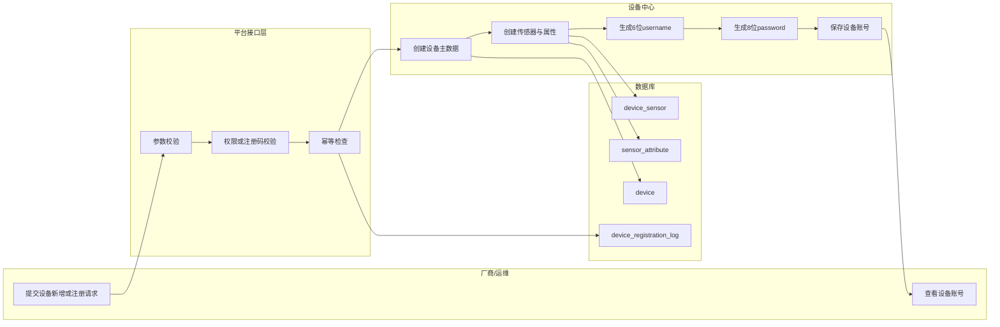
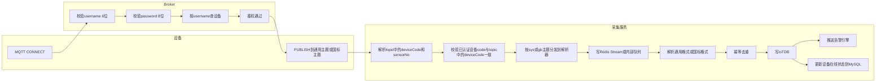

# 设备接入闭环差距分析与开发方案

## 文档版本说明

| 版本   | 日期         | 变更说明                                                                                                                                                                                                                       |
|------|------------|----------------------------------------------------------------------------------------------------------------------------------------------------------------------------------------------------------------------------|
| v1.0 | 2026-05-28 | 初始版本，定义设备账号体系、MQTT 双主题规范、IoTDB 建模方案                                                                                                                                                                                        |
| v1.1 | 2026-05-29 | 同步 2026-05-29 实施结果：完成 MQTT 通用报文解析、Redis Stream 缓冲、IoTDB 时序读写、monitor-data 查询接口；国标解析器预留 TODO 占位；补充所有新增代码注释                                                                                                                  |
| v1.2 | 2026-05-29 | 主题中 deviceId 改为 deviceCode（设备编码字段）；MqttDeviceSession 增加 deviceCode 字段实现直接比对；移除发布准入中的传感器校验（下沉至 MonitorMetadataService）；移除 SensorMetadata 未使用字段；移除 MonitorMetadataService 冗余 deviceMapper 查询；消除 SysMonitorPayloadParser 重复排序 |

## 1. 文档目的

本文档用于基于现有系统实现，对设备全生命周期、设备接入、MQTT 数据采集、监测数据落库、告警处理链路进行现状差距分析，并形成一份可直接落地的开发方案。

本版文档按最新要求统一调整为：

- MQTT 上报兼容通用格式与国标标准格式
- 通过订阅主题区分通用格式与国标格式
- 通用格式主题为 `sys/v1/{deviceCode}/{sensorNo}/updata`
- 其中 `{deviceCode}` 为设备编码（`device.code` 字段），`{sensorNo}` 为传感器编号
- 取消独立的认证凭证机制
- 改为轻量、可快速扩展上线的设备账号认证
- 设备认证仅通过设备用户名和设备密码校验合法性
- 用户名固定 6 位
- 密码固定 8 位
- 通用格式报文结构参考 `docs/物联网报送规则设计.MD`

## 2. 依据范围

### 2.1 业务与接口依据

- 现有数据库：`db/geo_hazard_monitor_v1.10.sql`
- 现有接口文档：`db/api_20260525.md`
- 设备接入参考文档：`docs/物联网平台接入文档.md`

### 2.2 现有系统技术栈

- 前端：Vue 3 + TypeScript + Element Plus
- 后端：Spring Boot + MyBatis + Redis + Quartz
- IoT 接入：`mica-mqtt-server-spring-boot-starter`
- 数据存储：MySQL + IoTDB

## 3. 本次调整后的目标约束

### 3.1 设备认证约束

为满足“接入设备需要用户名和密码，其中用户名 6 位、密码 8 位”的要求，同时取消复杂的凭证体系，建议将设备接入认证调整为轻量账号模型：

- `deviceCode`：平台设备编码（`device.code`），作为 MQTT 主题中的设备路由标识
- `username`：平台生成的设备接入用户名，固定 6 位
- `password`：平台生成的设备接入密码，固定 8 位

推荐规则如下：

- MQTT 主题中 `{deviceCode}` 直接使用平台 `device.code`
- `username`：6 位大写字母 + 数字组合，例如 `A7K9P2`
- `password`：8 位字母 + 数字组合，例如 `m4T9x2Q8`

说明：

- 不再单独建设”凭证中心”或”凭证版本体系”
- 设备合法性校验只依赖 `username + password`
- 主题中 `{deviceCode}` 承担设备路由作用；内部操作（IoTDB 路径、去重键）使用 `device.id`（Long）
- 设备账号信息直接存于设备主表或设备扩展字段，降低上线复杂度
- 为满足快速上线要求，设备密码按明文方式存储，不做哈希和密文加密

### 3.2 MQTT 主题规范

设备数据上报采用双主题规范，通过订阅主题区分报文格式：

通用格式主题：

```text
sys/v1/{deviceCode}/{sensorNo}/updata
```

国标格式主题：

```text
gb/v1/{deviceCode}/{sensorNo}/updata
```

字段定义：

- `{deviceCode}`：设备编码（与 `device.code` 字段对应）
- `{sensorNo}`：传感器编号

主题规范要求：

- 通用格式设备发布到 `sys/v1/{deviceCode}/{sensorNo}/updata`
- 国标格式设备发布到 `gb/v1/{deviceCode}/{sensorNo}/updata`
- 服务器侧先按订阅主题路由到对应解析器，再统一写入 IoTDB
- 服务器侧通过主题直接解析设备与传感器，不依赖 payload 再次定位主体
- 后续如需扩展指令下发、应答，可另行定义 `cmd`、`reply` 主题

### 3.3 接入协议使用约束

结合 `docs/物联网平台接入文档.md`，建议对接入协议进行如下统一：

- 注册接口：沿用接入文档中的注册 Payload 结构
- MQTT 鉴权：
  - `clientId` 可由设备自定义或采用 `device_id`
  - `username = 6位设备用户名`
  - `password = 8位设备密码`
- HTTP 数据上报：
  - 请求头或请求体中带 `deviceId`、`username`、`password`
- CoAP 数据上报：
  - 认证参数改为 `deviceId`、`username`、`password`

## 4. 现有实现对标分析

## 4.1 设备新增流程对标

### 需求目标

- 支持平台 Web 手工新增
- 支持设备注册 API 自动新增
- 支持新增成功后自动生成设备用户名和密码
- 支持管理员查看和重置设备账号

### 现状结论

- 已实现后台 Web 设备手工新增
- 已实现设备注册 API 自动新增
- 已实现设备新增后自动生成设备用户名和密码
- 已实现设备账号查看、密码重置与账号启停

### 当前实现状态

截至 `2026-05-28`，本节对应能力已落地：

- 已实现 `POST /api/v1/device-registry/register` 设备注册接口
- 已实现后台 `POST /api/v1/devices` DTO 入参与自动生成设备账号
- 已实现设备账号查询接口 `GET /api/v1/devices/{id}/auth-account`
- 已实现设备密码重置接口 `POST /api/v1/devices/{id}/auth-password/reset`
- 已实现设备账号状态变更接口 `PUT /api/v1/devices/{id}/auth-status`
- 已实现注册日志 `device_registration_log` 落库
- 已实现账号运维审计复用 `device_auth_log` 落库

当前仍存在的已知缺口：

- 设备 SN 冲突时，请求一致性校验仍主要覆盖设备基础字段，`monitorTypes` 与 `childDevices` 尚未纳入完整对比
- 权限标识虽已在接口层使用，但菜单与角色授权初始化 SQL 仍需单独补齐

### 现状说明

现有系统中，后端只提供了基础设备管理接口：

- `GET /api/v1/devices/page`
- `GET /api/v1/devices/{id}`
- `POST /api/v1/devices`
- `PUT /api/v1/devices/{id}`
- `DELETE /api/v1/devices/{id}`

现状问题：

- `POST /api/v1/devices` 只支持后台录入，不支持设备注册
- 入参直接使用 `Device` 实体，参数校验能力弱
- 新增设备后不会自动生成账号信息
- 无注册来源、注册日志、账号重置审计

## 4.2 设备账号生成与管理对标

### 需求目标

- 设备新增后自动生成设备用户名和密码
- 用户名固定 6 位
- 密码固定 8 位
- 支持平台查看账号、重置密码

### 现状结论

- 已新增设备账号字段
- 已实现用户名/密码生成逻辑
- 已实现设备账号查看接口
- 已实现设备账号重置接口
- 已实现设备账号启停与运维审计

### 风险

- 仍需补齐账号运维日志查询与可视化能力，便于后续审计追踪
- 仍需补齐权限初始化与角色授权，确保现场可直接使用

## 4.3 MQTT 设备接入服务对标

### 需求目标

- 支持设备通过用户名密码完成鉴权
- 支持通用主题与国标主题的双路解析
- 能稳定接收传感器数据
- 具备消息可靠性、断线重连、失败重试能力

### 现状结论

- 已集成 `mica-mqtt`
- MQTT 服务端已启动配置
- MQTT Broker 用户名密码认证已开启
- MQTT 认证处理器、发布权限校验、订阅校验、上下线状态回写已实现
- 已实现单设备单活跃连接、连续失败临时封禁、鉴权审计日志记录
- **截至 2026-05-29：MQTT 消息监听已从测试主题替换为正式双主题**
- **已实现 `MonitorIngestFacade` 作为统一接入门面，按 `sys` / `gb` 主题分发到对应解析器**
- **已实现 `SysMonitorPayloadParser` 通用 JSON 报文解析，支持单值、对象多值、兼容历史批量结构**
- **已实现 `GbMonitorPayloadParser` 国标解析器骨架，字节流解析部分预留 TODO 占位**
- **已实现 `Redis Stream` 缓冲、异步消费、幂等去重、三段退避重试与死信队列**
- **已实现 `IotdbTimeSeriesService` 时序写入，支持 aligned timeseries 惰性建模**
- **已实现 `MonitorDataQueryService` 查询服务，提供 `latest`、`page`、`chart` 三个接口，查询源统一为 IoTDB**
- **已实现 `MonitorDataController` 对齐 API 文档的接口契约，前端无需感知时序库细节**
- **MQTT 鉴权中心、发布准入、单设备单连接、国标解析器占位均为本次新增**

### 现状说明

接入配置层面已有：

- `mqtt.server.enabled = true`
- `mqtt.server.mqtt-listener.port = 1883`

但同时存在：

- `mqtt.server.auth.enable = true`
- `MqttServerAuthHandler` 已接入 `MqttDeviceAuthService`
- 已实现 `MqttServerPublishPermission` 和 `MqttServerSubscribeValidator`
- 已实现 `MqttConnectStatusListener` 在线/离线状态回写
- `MqttServerMessageListener` 已切换为正式双主题监听（`sys/v1/+/+/updata` 与 `gb/v1/+/+/updata`），从已认证上下文中提取
  deviceId 传入 ingest 门面

结论：MQTT 鉴权中心、消息解析、Redis Stream 缓冲、IoTDB 落库链路已全部打通，整体”设备接入闭环”核心路径已就绪。

## 4.4 业务模型实体关系对标

### 需求目标

- 隐患点可挂载多个设备
- 单设备可挂载多个传感器
- 传感器作为最小数据上报单元
- 传感器需要具备清晰的 `sensor_no`

### 现状结论

- `hazard_point -> device` 通过 `device_hazard_point` 已支持一对多
- `device -> sensor` 通过 `device_sensor` 已支持一对多
- `sensor -> attribute` 通过 `sensor_attribute` 已支持多属性扩展
- 传感器元数据基本满足最小上报单元要求

### 现状不足

- 绑定服务缺少严格存在性校验与状态校验
- 设备绑定逻辑采用“先删后插”，容易误覆盖原绑定信息
- `sensor_attribute` 缺少 `(sensor_id, attr_code)` 数据库唯一约束
- `device_sensor` 缺少统一的 `sensor_no` 规范字段
- 缺少接入协议、采样间隔、上传间隔、加报间隔等运行参数模型

## 4.5 数据流链路完整性对标

### 需求目标

形成完整链路：

1. 设备通过通用主题或国标主题上传数据
2. 平台按用户名密码鉴权并接收消息
3. 平台解析 Payload
4. 写入时序数据库
5. 推送告警引擎
6. 前端从时序数据库查询最新值、分页、图表
7. 业务结果回写 MySQL

### 现状结论

**截至 2026-05-29，数据全链路已全部打通：**

1. 设备通过通用主题或国标主题上报 MQTT 消息（通用已实现，国标已预留 TODO 占位）
2. 平台按用户名密码鉴权并接收消息（MQTT 鉴权中心已实现）
3. 平台按主题路由到解析器并解析 Payload（`MonitorIngestFacade` + `SysMonitorPayloadParser` 已实现）
4. 消息写入 Redis Stream 缓冲，由异步消费者落库 IoTDB（已实现，包括幂等去重、三段重试、死信队列）
5. 前端通过 `monitor-data` 接口从 IoTDB 查询最新值、分页和图表（已实现 `latest`、`page`、`chart` 三个接口）
6. IoTDB 写入成功后异步更新 `device.last_report_time`（已实现）
7. **本期不实现告警引擎联动，`alarm_record` 生成待后续迭代**

现有 `monitor_data` 表不再承接新增上报数据，已按"只进时序库"原则处理。

## 5. 接入文档 Payload 对接分析

## 5.1 注册 Payload 参考

参考 `docs/物联网平台接入文档.md` 中设备注册示例，建议注册接口兼容以下结构：

```json
{
  "sn": "388040221",
  "deviceName": "h920",
  "deviceType": "0",
  "network": "0",
  "protocol": "0",
  "monitorTypes": [
    {
      "type": "L1_LF",
      "sid": "1"
    }
  ]
}
```

本地组网扩展结构：

```json
{
  "sn": "388040221",
  "deviceName": "h920",
  "deviceType": "2",
  "network": "0",
  "protocol": "0",
  "monitorTypes": [
    {
      "type": "L1_LF",
      "sid": "1"
    }
  ],
  "childDevices": [
    {
      "sn": "123",
      "deviceName": "node1",
      "monitorTypes": [
        {
          "type": "L1_LF",
          "sid": "1"
        }
      ]
    }
  ]
}
```

### 建议映射规则

| 接入文档字段 | 平台落库字段 | 说明 |
| --- | --- | --- |
| `sn` | `device.sn` | 厂商设备序列号 |
| `deviceName` | `device.name` | 设备名称 |
| `deviceType` | `device.device_type` | 单参数/多参数/本地组网 |
| `network` | `device.network_type` | 4G/NB-Iot |
| `protocol` | `device.protocol_type` | MQTT/HTTP/COAP |
| `monitorTypes[].type` | 解析到监测类型 + 监测方法 | 如 `L1_LF` |
| `monitorTypes[].sid` | `device_sensor.sensor_no` | 统一映射为传感器编号 |
| `childDevices` | 子设备表或主从设备关系表 | 本地组网扩展 |

## 5.2 数据上报报文规范

设备上报报文需兼容两类格式，并通过订阅主题做出区分。

### 5.2.1 通用格式

通用格式使用主题：

```text
sys/v1/{deviceCode}/{sensorNo}/updata
```

通用格式报文结构参考 `docs/物联网报送规则设计.MD` 中的定义：

```json
{
  "version": "1.0",
  "deviceId": "123456",
  "sensorNo": "10010",
  "timestamp": 1694502400000,
  "data": {
    "time": 1694502400000,
    "value": 25.5
  }
}
```

字段说明：

- `version`：协议版本，固定值 `1.0`
- `sensorNo`：传感器编号，应与主题中的 `{sensorNo}` 一致
- `timestamp`：报文上报时间戳，单位毫秒
- `data.time`：数据采集时间戳，单位毫秒
- `data.value`：数据值

通用格式适配规则：

- 设备定位优先以主题中的 `{deviceCode}` 为准，内部解析时通过已认证会话获取 `deviceId`
- 传感器定位以主题中的 `{sensorNo}` 为准
- payload 中的 `sensorNo` 作为一致性校验字段（`deviceId` 字段已由 CONNECT 鉴权保障，不再在 payload 层重复校验）
- `data.value` 写入 IoTDB 对应 measurement
- `data.time` 作为 IoTDB 的时间列

### 5.2.2 国标标准格式

国标格式使用独立主题：

```text
gb/v1/{deviceCode}/{sensorNo}/updata
```

国标格式要求：

- 设备按国标原始报文结构上报
- 平台不强制要求国标设备改造成通用 JSON 结构
- 平台根据 `gb/v1/{deviceCode}/{sensorNo}/updata` 路由到国标解析器
- 国标解析器完成字段提取、标准化映射后统一写入 IoTDB

国标适配规则：

- 主题中的 `{deviceCode}`、`{sensorNo}` 作为设备与传感器主定位键
- 国标报文中的设备编码、测点编码作为辅助校验信息
- 若国标报文存在多指标，则拆分为多条 IoTDB 时序点位
- 若国标报文存在批量历史数据，则按时间点展开写入 IoTDB

### 5.2.3 平台统一落库规则

- 通用格式解析器负责处理 `sys/v1/{deviceCode}/{sensorNo}/updata`
- 国标解析器负责处理 `gb/v1/{deviceCode}/{sensorNo}/updata`
- 两类解析器最终统一输出标准时序写入模型
- 统一写入 IoTDB，避免业务层对报文来源做二次分支

## 5.3 MQTT 接入参考与本次调整后的落地方式

接入文档原始说明中允许设备使用用户名密码接入，本次项目统一收敛为：

- 鉴权账号：平台为设备生成 6 位用户名
- 鉴权密码：平台为设备生成 8 位密码
- 通用主题：`sys/v1/{deviceCode}/{sensorNo}/updata`
- 国标主题：`gb/v1/{deviceCode}/{sensorNo}/updata`

推荐约束如下：

- `clientId` 可使用 `device-{deviceCode}`，便于连接追踪
- `username` 必须为平台设备账号
- `password` 必须为平台设备密码
- 主题中的 `{deviceCode}` 必须与已认证设备的 `code` 字段一致
- 订阅主题决定解析器类型，通用主题走通用解析器，国标主题走国标解析器

兼容策略：

- 第一阶段兼容旧测试主题与旧接入脚本
- 第二阶段强制按主题区分通用格式与国标格式

## 6. 当前剩余差距清单

截至 `2026-05-28`，设备注册中心、设备账号中心、设备账号运维相关的部分差距已关闭。为避免与前文“当前实现状态”冲突，本节调整为“剩余差距清单”，并保留已关闭项用于跟踪。

| 分类   | 问题描述                                                | 影响业务场景        | 严重等级 | 当前状态                                                                                 |
|------|-----------------------------------------------------|---------------|------|--------------------------------------------------------------------------------------|
| 功能缺失 | 设备注册 API 自动新增能力                                     | 厂商批量接入、现场部署   | 高    | 已关闭                                                                                  |
| 功能缺失 | 设备用户名和密码自动生成能力                                      | 设备接入鉴权        | 高    | 已关闭                                                                                  |
| 功能缺失 | 用户名 6 位、密码 8 位规则校验与存储模型                             | 轻量认证上线        | 高    | 已关闭                                                                                  |
| 功能缺失 | 设备账号查看与密码重置能力                                       | 账号发放、现场换密     | 高    | 已关闭                                                                                  |
| 功能缺失 | 基于订阅主题区分通用格式与国标格式的双路解析能力                            | 设备实时数据上报      | 高    | **已实现**（通用已实现，国标预留 TODO 占位）                                                          |
| 功能缺失 | 基于 IoTDB 的监测数据查询服务                                  | 曲线图、数据表、最新值   | 高    | **已实现**（`latest`/`page`/`chart` 三接口）                                                 |
| 功能缺失 | 告警引擎实现                                              | 预警判据执行、记录生成   | 高    | 未实现（本期不落地，待后续迭代）                                                                     |
| 功能缺失 | 时序数据库写入与查询实现                                        | 长周期趋势分析       | 高    | **已实现**（IoTDB 时序写入与查询已落地）                                                            |
| 逻辑缺陷 | 设备新增直接使用实体入参，参数约束不完整                                | 脏数据写入         | 中    | 已关闭                                                                                  |
| 逻辑缺陷 | 绑定设备采用先删后插，缺少细粒度变更保护                                | 安装位置信息被覆盖     | 中    | 已关闭                                                                                  |
| 逻辑缺陷 | 绑定时未校验设备、隐患点状态与存在性                                  | 关系错误          | 高    | 已关闭                                                                                  |
| 逻辑缺陷 | `device_sensor` 缺少统一 `sensor_no` 字段与唯一性约束           | 无法稳定按主题定位传感器  | 高    | 已关闭                                                                                  |
| 逻辑缺陷 | 属性唯一性仅做服务层校验，无数据库唯一约束                               | 并发重复属性        | 中    | 已关闭                                                                                  |
| 逻辑缺陷 | 注册重复 SN 时，一致性校验尚未覆盖 `monitorTypes` 与 `childDevices` | 重复注册冲突判断不准确   | 中    | 部分实现                                                                                 |
| 性能不足 | 缺少基于 Redis Stream 或内存队列的接入缓冲、重试、死信机制                | 大并发和网络抖动场景    | 高    | **已实现**（`MonitorIngestStreamService` + `MonitorIngestConsumerService`，三段退避重试 + 死信队列） |
| 性能不足 | 未形成面向时序数据库的分表、标签、压缩和冷热策略                            | 历史曲线查询        | 中    | 未实现                                                                                  |
| 安全隐患 | MQTT 鉴权中心未形成完整消息闭环，当前仅完成鉴权与权限控制                     | 消息解析与落库仍待补齐   | 高    | 已关闭                                                                                  |
| 安全隐患 | MQTT 结构化异常与统一收敛已实现，但 HTTP 管理侧尚未暴露统一错误视图             | 运维排障仍主要依赖日志   | 中    | 部分实现                                                                                 |
| 安全隐患 | 设备账号变更无审计                                           | 账号泄露后无法追责     | 中    | 已关闭                                                                                  |
| 安全隐患 | 设备账号相关权限标识缺少菜单与角色初始化脚本                              | 已开发接口无法直接授权使用 | 中    | 未处理                                                                                  |

## 7. 整体开发方案

## 7.1 总体设计原则

- 兼容现有后台设备管理功能，不直接推翻已有表结构
- 以 `device_id + username + password` 作为轻量设备接入身份体系
- 不建设独立凭证中心，账号信息直接附着于设备
- MySQL 只存业务数据，不存设备上报原始信息和监测时序数据
- 设备上报信息只写入 IoTDB
- 查询类接口优先直接查询 IoTDB
- MQTT、HTTP、CoAP 接入统一走设备账号认证
- 采集链路通过 Redis Stream 或应用内异步队列实现幂等、重试、死信与审计

## 7.2 功能开发清单

### P0 必须实现

| 模块         | 开发内容                                                                                | 交付要求         | 当前状态                                                                                    |
|------------|-------------------------------------------------------------------------------------|--------------|-----------------------------------------------------------------------------------------|
| 设备注册中心     | 新增设备注册 API，兼容单参数、多参数、本地组网 Payload                                                   | 支持幂等注册       | 已实现                                                                                     |
| 设备账号中心     | 自动生成 6 位用户名和 8 位密码，落库设备表                                                            | 新增即生成        | 已实现                                                                                     |
| 设备账号运维     | 查看设备账号、重置密码、记录审计日志                                                                  | 轻量可运维        | 已实现                                                                                     |
| MQTT 鉴权中心  | Broker 启用用户名密码鉴权、发布权限控制、失败封禁、单设备单连接治理                                               | 拒绝未授权设备并保留审计 | 已实现                                                                                     |
| MQTT 消息采集  | 解析 `sys/v1/{deviceCode}/{sensorNo}/updata` 与 `gb/v1/{deviceCode}/{sensorNo}/updata` | 支持 QoS 0/1   | **已实现**（通用 JSON 已实现；国标预留 TODO 占位，等待真实样例）                                                |
| IoTDB 时序服务 | 写入 IoTDB，并提供最新值、分页、图表查询                                                             | 完整查询链路       | **已实现**（`MonitorDataController` + `IotdbTimeSeriesService` + `MonitorDataQueryService`） |
| 告警引擎       | 判据执行、告警记录生成                                                                         | 支持启停和重试      | 未实现                                                                                     |
| 设备在线状态服务   | MQTT 在线/离线、最后鉴权 IP/时间更新                                                             | 与业务设备状态联动    | 已实现                                                                                     |

### P1 后续迭代

| 模块 | 开发内容 | 交付要求 |
| --- | --- | --- |
| 子设备组网模型 | 主子设备关系、子设备数据独立查询 | 本地组网增强 |
| 指令中心 | 完整指令下发、回执、通信记录 | 后续扩展 |
| 固件升级中心 | MQTT/CoAP 升级流程 | 支持包大小协商 |
| 批量注册与批量账号导出 | 厂商批量接入 | 提升交付效率 |

## 8. 数据库改造方案

## 8.1 改造目标

- 为设备增加轻量认证账号字段
- 支撑 6 位用户名与 8 位密码
- 支撑注册日志、账号审计
- 支撑主题中的 `{sensorNo}` 稳定映射
- 明确 MySQL 与 IoTDB 的职责边界

## 8.2 SQL 变更脚本

### 当前实现状态

截至 `2026-05-28`，以下数据库改造项已在工作区实现：

- 已新增 `device.sn`
- 已新增 `device.device_type`
- 已新增 `device.network_type`
- 已新增 `device.protocol_type`
- 已新增 `device.register_source`
- 已新增 `device.vendor_name`
- 已新增 `device.auth_username`
- 已新增 `device.auth_password`
- 已新增 `device.auth_status`
- 已新增 `device.registered_at`
- 已新增 `device.last_auth_time`
- 已新增 `device.last_auth_ip`
- 已新增 `device.auth_username` 唯一索引
- 已新增 `device_sensor.sensor_no`
- 已新增 `device_sensor(device_id, sensor_no)` 唯一索引
- 已新增 `device_registration_log`
- 已新增 `device_auth_log`
- 已新增 `sensor_attribute(sensor_id, attr_code)` 唯一索引

其中：

- `device_registration_log` 已用于设备注册日志落库
- `device_auth_log` 已复用于账号查看、密码重置、账号启停的运维审计落库

```sql
-- V1.5_01_device_access_upgrade.sql

ALTER TABLE `device`
    ADD COLUMN `sn` varchar(100) DEFAULT NULL COMMENT '设备SN' AFTER `code`,
    ADD COLUMN `device_type` tinyint DEFAULT NULL COMMENT '设备类型:0单参数,1多参数,2本地组网' AFTER `name`,
    ADD COLUMN `network_type` tinyint DEFAULT NULL COMMENT '网络类型:0蜂窝,1NB-Iot' AFTER `device_type`,
    ADD COLUMN `protocol_type` varchar(20) NOT NULL DEFAULT 'MQTT' COMMENT '接入协议:MQTT/HTTP/COAP' AFTER `network_type`,
    ADD COLUMN `register_source` varchar(20) NOT NULL DEFAULT 'MANUAL' COMMENT '注册来源:MANUAL/API/IMPORT' AFTER `protocol_type`,
    ADD COLUMN `vendor_name` varchar(200) DEFAULT NULL COMMENT '厂商名称' AFTER `register_source`,
    ADD COLUMN `auth_username` char(6) DEFAULT NULL COMMENT '设备接入用户名,固定6位' AFTER `vendor_name`,
    ADD COLUMN `auth_password` varchar(32) DEFAULT NULL COMMENT '设备接入密码,明文存储' AFTER `auth_username`,
    ADD COLUMN `auth_status` tinyint NOT NULL DEFAULT 1 COMMENT '账号状态:1有效,2禁用' AFTER `auth_password`,
    ADD COLUMN `registered_at` datetime DEFAULT NULL COMMENT '注册时间' AFTER `last_report_time`,
    ADD COLUMN `last_auth_time` datetime DEFAULT NULL COMMENT '最近鉴权时间' AFTER `registered_at`,
    ADD COLUMN `last_auth_ip` varchar(64) DEFAULT NULL COMMENT '最近鉴权IP' AFTER `last_auth_time`;

UPDATE `device`
SET `registered_at` = COALESCE(`registered_at`, `create_time`)
WHERE `registered_at` IS NULL;

ALTER TABLE `device`
    ADD UNIQUE KEY `uk_device_auth_username` (`auth_username`),
    ADD KEY `idx_device_register_source` (`register_source`),
    ADD KEY `idx_device_auth_status` (`auth_status`);

ALTER TABLE `device_sensor`
    ADD COLUMN `sensor_no` varchar(32) DEFAULT NULL COMMENT '传感器编号' AFTER `sensor_code`;

UPDATE `device_sensor`
SET `sensor_no` = COALESCE(`sensor_no`, `sensor_code`)
WHERE `sensor_no` IS NULL OR `sensor_no` = '';

ALTER TABLE `device_sensor`
    MODIFY COLUMN `sensor_no` varchar(32) NOT NULL COMMENT '传感器编号',
    ADD UNIQUE KEY `uk_device_sensor_no` (`device_id`, `sensor_no`);

CREATE TABLE `device_registration_log`
(
    `id` bigint NOT NULL AUTO_INCREMENT COMMENT '主键ID',
    `request_id` varchar(64) NOT NULL COMMENT '请求幂等ID',
    `register_code` varchar(64) DEFAULT NULL COMMENT '设备注册码',
    `register_source` varchar(20) NOT NULL COMMENT '注册来源',
    `vendor_name` varchar(200) DEFAULT NULL COMMENT '厂商名称',
    `device_id` bigint DEFAULT NULL COMMENT '设备ID',
    `sn` varchar(100) DEFAULT NULL COMMENT '设备SN',
    `result_status` varchar(20) NOT NULL COMMENT 'SUCCESS/FAIL',
    `failure_reason` varchar(500) DEFAULT NULL COMMENT '失败原因',
    `request_body` json DEFAULT NULL COMMENT '原始请求',
    `create_time` datetime DEFAULT CURRENT_TIMESTAMP COMMENT '创建时间',
    PRIMARY KEY (`id`),
    UNIQUE KEY `uk_device_register_request_id` (`request_id`),
    KEY `idx_device_register_device_id` (`device_id`)
) ENGINE=InnoDB DEFAULT CHARSET=utf8mb4 COMMENT='设备注册日志';

CREATE TABLE `device_auth_log`
(
    `id` bigint NOT NULL AUTO_INCREMENT COMMENT '主键ID',
    `device_id` bigint NOT NULL COMMENT '设备ID',
    `auth_username` char(6) NOT NULL COMMENT '设备用户名',
    `auth_result` tinyint NOT NULL COMMENT '1成功,0失败',
    `client_id` varchar(128) DEFAULT NULL COMMENT 'MQTT客户端ID',
    `client_ip` varchar(64) DEFAULT NULL COMMENT '客户端IP',
    `failure_reason` varchar(255) DEFAULT NULL COMMENT '失败原因',
    `create_time` datetime DEFAULT CURRENT_TIMESTAMP COMMENT '创建时间',
    PRIMARY KEY (`id`),
    KEY `idx_device_auth_log_device` (`device_id`, `create_time`)
) ENGINE=InnoDB DEFAULT CHARSET=utf8mb4 COMMENT='设备认证日志';

ALTER TABLE `sensor_attribute`
    ADD UNIQUE KEY `uk_sensor_attr_code` (`sensor_id`, `attr_code`);
```

## 8.3 变更原因

| 变更项 | 原因 |
| --- | --- |
| `device.auth_username` 等账号字段 | 以轻量方式实现设备账号认证 |
| `device_sensor.sensor_no` | 支撑主题中传感器编号稳定映射 |
| `device_registration_log` | 支撑设备注册审计与幂等 |
| `device_auth_log` | 支撑认证日志与问题追踪 |
| `sensor_attribute` 唯一索引 | 防止重复属性编码 |

## 8.4 IoTDB 详细建模方案

推荐以设备为路径节点建模：

```sql
CREATE DATABASE root.geo_hazard;
CREATE TIMESERIES root.geo_hazard.d101.s1.displacement WITH DATATYPE=DOUBLE, ENCODING=GORILLA, COMPRESSOR=SNAPPY;
CREATE TIMESERIES root.geo_hazard.d101.s1.quality WITH DATATYPE=INT32, ENCODING=RLE, COMPRESSOR=SNAPPY;
```

路径建议：

- `root.geo_hazard.d{device_id}.s{sensor_no}.{attr_code}`

### 路径规划

- 建议数据库：`root.geo_hazard`
- 设备路径：`root.geo_hazard.d{device_id}`
- 传感器路径：`root.geo_hazard.d{device_id}.s{sensor_no}`
- 指标路径：`root.geo_hazard.d{device_id}.s{sensor_no}.{attr_code}`

### 标签与属性映射建议

- `device_id`：体现在设备层级路径
- `sensor_no`：体现在传感器层级路径
- `attr_code`：作为 measurement
- `hazard_point_id`、`sensor_id`、`monitor_type_id`：作为 aligned timeseries 的属性标签或在业务侧缓存映射
- `quality`：独立 measurement
- `raw_payload`：仅在必要场景保留摘要，不建议保存完整原文

### 建模建议

- 同一传感器下使用 aligned timeseries，减少写入与查询开销
- 常用值如 `quality`、`status`、`battery` 可作为固定 measurement
- 业务指标如位移、雨量、水位等以 `attr_code` 命名
- 所有历史值、实时值、补报值统一写入 IoTDB，不落 MySQL

### IoTDB 建库示例

```sql
CREATE DATABASE root.geo_hazard;
CREATE ALIGNED TIMESERIES root.geo_hazard.d101.s1(
  displacement DOUBLE,
  quality INT32,
  battery FLOAT
) WITH ENCODING=(GORILLA, RLE, GORILLA), COMPRESSOR=SNAPPY;
```

### IoTDB 查询示例

最新值查询：

```sql
SELECT LAST displacement, LAST quality
FROM root.geo_hazard.d101.s1;
```

时间区间曲线查询：

```sql
SELECT displacement
FROM root.geo_hazard.d101.s1
WHERE time >= 2026-05-01T00:00:00+08:00
  AND time < 2026-05-02T00:00:00+08:00;
```

窗口聚合查询：

```sql
SELECT AVG(displacement), MAX(displacement), MIN(displacement)
FROM root.geo_hazard.d101.s1
GROUP BY ([2026-05-01T00:00:00+08:00, 2026-05-02T00:00:00+08:00), 1h);
```

### 时序写入原则

- 设备上报原始信息不进入 MySQL
- 设备实时值、历史值、文件元数据索引全部写 IoTDB
- 告警引擎消费 IoTDB 写入结果或接入服务内部事件
- MySQL 只保留业务结果，如 `alarm_record`、设备状态、注册日志、认证日志

### 接入缓冲与重试建议

- 优先使用 `Redis Stream` 作为轻量接入缓冲层
- MQTT 消费后先写 `Redis Stream`
- 异步写入 IoTDB
- 写入失败进入重试队列
- 超过重试阈值进入死信队列
- 不在 MySQL 中保存原始 payload

### IoTDB 配置建议

- 副本数按单机或集群部署方式配置
- 压缩器优先使用 `SNAPPY`
- 浮点型指标优先使用 `GORILLA`
- 整型状态量优先使用 `RLE`
- 按设备量级规划分区和 TTL
- 冷数据归档周期建议按 6 个月或 12 个月配置

## 8.5 对现有业务影响

- 不破坏原有设备、传感器、隐患点关系
- 现有后台设备管理接口仍可继续使用
- 新增字段默认兼容老数据
- 旧设备需补充生成用户名和密码
- `device_sensor` 需补齐 `sensor_no`
- 现有 `monitor_data` 表不再承接新增上报数据，可保留用于历史兼容查询或后续清理

## 8.6 回滚方案

- 先关闭新注册入口和新 MQTT 鉴权
- 导出 `device_registration_log`、`device_auth_log`
- 删除新增表、索引和字段
- 恢复旧主题兼容解析逻辑
- 停止 IoTDB 写入，回退到原历史兼容方案

## 9. 接口迭代方案

## 9.1 新增设备注册接口

- 路径：`POST /api/v1/device-registry/register`
- 描述：设备或厂商通过注册码自动注册设备
- 权限：匿名，但需 `registerCode`

### 当前实现状态

- 已实现
- 已支持 `requestId` 幂等
- 已支持 `registerCode` 校验
- 已支持单设备监测类型注册
- 已支持本地组网场景下 `childDevices` 生成传感器
- 已支持注册日志落库
- 已支持返回 `deviceId`、`username`、`password`、`created`

### 请求参数

```json
{
  "requestId": "REG-20260527-0001",
  "registerCode": "ABCDEF123456",
  "vendorName": "成都某厂商",
  "sn": "388040221",
  "deviceName": "h920",
  "deviceType": "0",
  "network": "0",
  "protocol": "0",
  "monitorTypes": [
    {
      "type": "L1_LF",
      "sid": "1"
    }
  ]
}
```

### 成功响应

```json
{
  "code": 200,
  "msg": "注册成功",
  "data": {
    "deviceId": 101,
    "username": "A7K9P2",
    "password": "m4T9x2Q8",
    "created": true
  },
  "timestamp": 1779895538000
}
```

### 错误码

| 错误码 | 说明 |
| --- | --- |
| 400 | 参数缺失、Payload 非法 |
| 401 | 注册码无效 |
| 404 | 监测类型不存在 |
| 409 | 设备 SN 已存在但请求不一致 |
| 500 | 服务器异常 |

## 9.2 增强后台设备手工新增接口

- 路径：`POST /api/v1/devices`
- 权限：`basic:device:add`
- 调整：
  - 改为 DTO 入参
  - 可选传 `sn`、`protocolType`、`deviceType`
  - 创建设备后自动生成设备账号
  - 可同时创建默认 `sensor_no`

### 当前实现状态

- 已实现 DTO 入参替代直接实体入参
- 已支持 `sn`、`protocolType`、`deviceType`、`networkType`、`vendorName`
- 已实现创建设备后自动生成账号并在响应中返回
- `sensor_no` 的默认创建能力当前仍依赖注册流程或传感器管理流程，手工新增设备接口本身暂未自动创建设备传感器

### 响应补充

```json
{
  "code": 200,
  "msg": "新增成功",
  "data": {
    "id": 101,
    "username": "A7K9P2",
    "password": "m4T9x2Q8"
  }
}
```

## 9.3 新增设备账号查询接口

- 路径：`GET /api/v1/devices/{id}/auth-account`
- 权限：`basic:device:auth:view`

### 当前实现状态

- 已实现
- 已返回 `deviceId`、`username`、`password`、`authStatus`、`registeredAt`、`lastAuthTime`、`lastAuthIp`
- 已复用 `device_auth_log` 记录后台查看账号审计

### 响应

```json
{
  "code": 200,
  "msg": "成功",
  "data": {
    "deviceId": 101,
    "username": "A7K9P2",
    "password": "m4T9x2Q8",
    "authStatus": 1,
    "lastAuthTime": "2026-05-27 10:15:22"
  }
}
```

## 9.4 新增设备密码重置接口

- 路径：`POST /api/v1/devices/{id}/auth-password/reset`
- 权限：`basic:device:auth:reset`

### 当前实现状态

- 已实现
- 已支持按 8 位规则重新生成密码
- 已返回新的 `username`、`password`
- 已复用 `device_auth_log` 记录后台密码重置审计
- 请求体中的 `forceOffline` 当前仅记录进审计日志，尚未联动设备下线控制

### 请求体

```json
{
  "reason": "现场更换设备",
  "forceOffline": true
}
```

### 响应

```json
{
  "code": 200,
  "msg": "重置成功",
  "data": {
    "username": "A7K9P2",
    "password": "r8P2m6Xa"
  }
}
```

## 9.5 新增监测数据接口实现

**截至 2026-05-29，已全部实现，查询源统一为 IoTDB：**

- `GET /api/v1/monitor-data/chart` — 按隐患点查询时间区间内单指标序列及统计值（`labels`、`values`、`unit`、`attrName`、
  `maxValue`、`minValue`、`avgValue`）
- `GET /api/v1/monitor-data/page` — 按隐患点关联测点分页查询历史数据，返回结构与 API 文档完全一致
- `GET /api/v1/monitor-data/latest` — 按隐患点查询所有绑定的设备/传感器/指标的 IoTDB 最新值

实现组件：

- [MonitorDataController](file:///d:/Code/Projects/geo_hazard_monitor/server/zwei-iot/src/main/java/com/zwei/iot/timeseries/controller/MonitorDataController.java) —
  REST 接口层，对齐 API 文档契约
- [MonitorDataQueryService](file:///d:/Code/Projects/geo_hazard_monitor/server/zwei-iot/src/main/java/com/zwei/iot/timeseries/service/MonitorDataQueryService.java) —
  查询编排层，按隐患点枚举测点后合并结果
- [IotdbTimeSeriesService](file:///d:/Code/Projects/geo_hazard_monitor/server/zwei-iot/src/main/java/com/zwei/iot/timeseries/service/IotdbTimeSeriesService.java) —
  时序库底层读写
- [IotdbPathResolver](file:///d:/Code/Projects/geo_hazard_monitor/server/zwei-iot/src/main/java/com/zwei/iot/timeseries/support/IotdbPathResolver.java) —
  路径解析，路径模型 `root.geo_hazard.d{deviceId}.s{sensorNo}.{attrCode}`

## 9.6 新增告警中心接口实现

> **本期不落地告警引擎，以上接口待后续迭代实现。** 接入链路已预留 `DataIngestEvent` 扩展点，可在后续接入告警判据服务。

需落地以下文档已定义接口，告警结果仍写 MySQL：

- `GET /api/v1/hazard-points/{hpId}/alarm-criteria`
- `POST /api/v1/hazard-points/{hpId}/alarm-criteria`
- `PUT /api/v1/alarm-criteria/{id}`
- `GET /api/v1/alarm-records/page`
- `PUT /api/v1/alarm-records/{id}/handle`

## 10. 业务流程重构方案

## 10.1 设备新增与账号生成泳道图



### 异常分支处理

- 参数不合法：返回 `400`
- 注册码无效：返回 `401`
- 重复注册：按 `requestId` 返回已生成结果
- 设备 SN 冲突：返回 `409`
- 生成账号失败：整体事务回滚

## 10.2 MQTT 数据接入泳道图



### 异常处理

- 用户名或密码不匹配：拒绝连接
- 主题不符合通用或国标规范：丢弃并记录日志
- 已认证设备的 code 与主题中的 `deviceCode` 不一致：拒绝消费
- 通用格式或国标格式解析失败：写入失败原因，进入重试
- IoTDB 写入失败：进入重试队列或死信队列
- 告警执行失败：不回滚 IoTDB 数据，改为异步补偿

## 11. MQTT 接入优化方案

## 11.1 鉴权方案

- `username = 6位平台生成设备用户名`
- `password = 8位平台生成设备密码`
- `topic = sys/v1/{deviceCode}/{sensorNo}/updata` 或 `gb/v1/{deviceCode}/{sensorNo}/updata`

鉴权逻辑：

1. 根据 `username` 查设备
2. 校验设备账号状态是否有效
3. 直接比对明文密码
4. 记录 `device_auth_log`
5. 刷新 `last_auth_time`、`last_auth_ip`
6. 连续失败达到阈值后临时封禁
7. 同一设备重复登录时挤掉旧连接

消费逻辑：

1. 解析主题中的 `deviceCode`
2. 比对已鉴权设备的 `code` 与 `deviceCode` 是否一致（通过 `MqttDeviceSession.deviceCode()` 直接比对，无需查库）
3. 解析 `sensorNo`
4. 根据主题前缀判断通用解析器或国标解析器
5. 通过已认证会话中的 `deviceId` 配合 `sensorNo` 定位传感器（`MonitorMetadataService`）
6. 再进入报文解析并写入 IoTDB

当前已落地范围：

- 已实现 `CONNECT` 鉴权、失败封禁、设备账号状态校验、协议类型校验
- 已实现发布主题准入：仅允许 `sys/v1/{deviceCode}/{sensorNo}/updata` 与 `gb/v1/{deviceCode}/{sensorNo}/updata`
- 已实现订阅主题校验：当前设备订阅校验规则为 `sys/v1/{deviceCode}/{sensorCode}/updata`
- 已实现 `topic` 中 `deviceCode` 与已鉴权会话 `deviceCode` 直接比对（无需查库）
- 已实现测点归属和启用状态校验（下沉至 `MonitorMetadataService.requireSensorMetadata()` 统一执行）
- 已实现上下线状态回写与 `device_auth_log` 审计落库
- 已实现结构化 MQTT 异常体系与统一异常收敛日志输出
- 已实现通用报文解析（`SysMonitorPayloadParser`）、Redis Stream 缓冲、异步消费、幂等去重、三段退避重试、死信队列、IoTDB 写入
- 国标解析器预留 TODO 占位，等待真实报文样例

## 11.2 连接保活建议

- `keepAlive = 60s`
- 服务端心跳超时：`150000ms`
- `cleanSession = false`
- 发布 `qos = 1`
- 同一设备只允许 1 个活跃连接，重复登录踢旧连接

## 11.3 消息可靠性建议

- 数据上报 QoS 使用 `1`
- 接入后先写 `Redis Stream` 或应用内缓冲队列，再异步写入 IoTDB
- 重试策略：
  - 第 1 次：5 秒
  - 第 2 次：30 秒
  - 第 3 次：120 秒
- 超过 3 次进入死信

## 11.4 流量控制建议

- 单设备每秒最多 `50` 条消息
- 单条消息最大 `256KB`
- 单连接最大未确认消息数 `100`
- 连续鉴权失败超过阈值后临时封禁

## 11.5 报文解析策略

### 通用格式解析

- 发布主题：`sys/v1/{deviceCode}/{sensorNo}/updata`
- 按 `docs/物联网报送规则设计.MD` 中定义的 JSON 结构解析
- 设备身份由 CONNECT 鉴权保障，通过 `ChannelContext.getUserId()` 获取 deviceId
- 校验 `sensorNo` 与 topic 中的 `sensorNo` 一致（deviceId 不再在 payload 层重复校验）
- 将 `data.time`、`data.value` 标准化后写入 Redis Stream

### 国标格式解析

- 发布主题：`gb/v1/{deviceCode}/{sensorNo}/updata`
- 按国标原始报文格式解析
- 通过国标字段映射表转换为内部标准时序模型
- 单报文多指标拆分为多条 IoTDB 点位
- 批量历史记录按时间序列逐条写入 IoTDB

## 12. 测试验证方案

### 当前已完成验证

- 单元测试：
  - `MqttServerAuthHandlerTest`
  - `MqttServerPublishPermissionTest`
  - `MqttServerSubscribeValidatorTest`
  - `MqttServiceExceptionTest`
  - `SysMonitorPayloadParserTest`
  - `DeviceServiceImplTest`
  - `DeviceSensorServiceImplTest`
  - `DeviceRegistryServiceImplTest`
  - `DeviceAuthAccountGeneratorTest`
  - `HazardPointGroupServiceImplTest`
- 集成测试：
  - `MqttAuthCenterIntegrationTest`
- 性能烟测：
  - `MqttAuthCenterPerformanceTest`
- 已执行 `mvn -pl zwei-iot test`，当前 `zwei-iot` 模块 **83 个测试全部通过**

## 12.1 单元测试

| 场景 | 验证内容 | 通过标准 |
| --- | --- | --- |
| 设备账号生成 | 用户名固定 6 位、密码固定 8 位 | 长度和规则正确 |
| 账号唯一性 | 用户名不重复 | 无冲突 |
| 注册幂等 | 重复 `requestId` 返回同一结果 | 不重复创建设备 |
| MQTT 鉴权 | 正确用户名密码通过，错误账号拒绝 | 结果符合预期 |
| 主题解析 | 通用主题与国标主题解析正确 | 设备与传感器定位正确 |
| 报文解析 | 通用 JSON 与国标报文解析正确 | 字段映射正确 |
| 幂等去重 | 同 `messageKey` 不重复入库 | 只落一条 |

当前已补充并通过的单元测试：

- `DeviceRegistryServiceImplTest`
- `DeviceServiceImplTest`
- `MqttServerSubscribeValidatorTest`

其中已覆盖：

- 设备注册幂等返回
- 手工账号状态变更
- 账号查看审计落库
- 密码重置审计落库
- MQTT 主题格式校验

## 12.2 集成测试

| 场景 | 方法 | 验证标准 |
| --- | --- | --- |
| Web 手工新增设备 | MockMvc + DB 校验 | 自动生成设备账号 |
| 设备注册 API 自动新增 | MockMvc + DB 校验 | 支持单参数/多参数/本地组网 |
| 隐患点设备绑定 | 接口调用后核对数据 | `device_count` 正确 |
| MQTT 通用格式上报 | 模拟客户端接入 | 通用 JSON 数据成功写入 IoTDB |
| MQTT 国标格式上报 | 模拟国标设备接入 | 国标报文成功写入 IoTDB |
| 主题路由分发 | 使用通用主题与国标主题发布消息 | 正确分发到对应解析器 |
| 告警引擎执行 | 构造超阈值数据 | 生成 `alarm_record` |

## 12.3 端到端测试

重点覆盖以下场景：

- 两种设备新增方式成功率验证
- 6 位用户名和 8 位密码生成与登录校验
- 通用主题与国标主题全链路连通性验证
- 隐患点-设备-传感器绑定关系正确性验证
- 告警记录生成与处置验证

## 12.4 核心验收指标

- 设备新增成功率 >= 99%
- MQTT 鉴权成功率 >= 99%
- 双主题解析准确率 = 100%
- 重复消息不重复写入 IoTDB
- 实时链路端到端延迟 P95 <= 5 秒
- 告警生成准确率 >= 99%

## 13. 上线过渡方案

## 13.1 灰度发布策略

分四步上线：

1. 先上数据库脚本和兼容代码
2. 灰度少量厂商使用注册接口与设备账号
3. 灰度开启 MQTT 用户名密码鉴权
4. 全量切换到“通用主题 + 国标主题”双路解析和 IoTDB 写入链路

## 13.2 存量数据迁移

- 为存量设备批量生成 6 位用户名和 8 位密码
- 为存量传感器批量补齐 `sensor_no`
- 向存量设备厂商发放新账号和新主题规范
- 保留旧设备编号字段，避免影响已有页面和绑定关系

## 13.3 业务回滚机制

回滚触发条件建议：

- MQTT 鉴权失败率超过 5%
- 主题解析失败率超过 1%
- 数据入库失败率超过 1%
- 告警链路异常持续 10 分钟

回滚动作：

- 关闭注册入口
- 关闭新鉴权逻辑
- 恢复旧主题兼容模式
- 暂停 IoTDB 写入新链路

## 13.4 上线期监控项

- 设备注册成功数/失败数
- MQTT 在线连接数
- 鉴权失败数
- 主题解析失败数
- `Redis Stream` 积压量
- 死信数
- IoTDB 写入 TPS
- 告警生成耗时

## 14. 实施优先顺序建议

### 第一阶段

- 设备注册中心
- 设备账号中心
- 6 位用户名、8 位密码生成规则
- MQTT 鉴权实现
- 通用主题与国标主题双路解析实现

### 第二阶段

- Redis Stream 接入缓冲
- 通用/国标报文解析
- IoTDB 写入
- 最新值/分页/曲线接口

### 第三阶段

- 告警引擎
- 通知分发
- 指令中心
- 固件升级链路

### 第四阶段

- 本地组网增强
- 批量导入导出

## 15. 最终结论

当前系统已经具备隐患点、设备、传感器、属性等基础主数据模型，也具备 MQTT 基础组件和部分监测数据、告警相关数据库表，但尚未形成真正可上线的“设备接入闭环”。

截至 `2026-05-28`，第一阶段中与设备主数据和账号体系直接相关的能力已取得阶段性进展：

- 已实现设备注册中心
- 已实现设备账号中心
- 已实现设备账号运维与审计落库
- 已完成相应数据库字段、日志表和部分单元测试补充

但以下关键链路仍未落地，因此整体结论仍保持不变：

- MQTT 鉴权中心已打通，但消息消费闭环未完成
- 双主题解析未实现
- IoTDB 写入与查询链路未实现
- 告警引擎未实现

本次方案调整后，建议以“设备 ID + 设备用户名 + 设备密码”为统一轻量认证模型，并通过订阅主题区分通用格式与国标格式。完成后，系统可形成如下完整闭环：

- 支持 Web 与注册 API 双通道设备新增
- 自动生成并管理设备账号
- 支持 MQTT 用户名密码鉴权
- 支持通用格式与国标格式双路解析，并将设备上报信息只写入 IoTDB
- 支持告警判据执行与业务联动
- 支持灰度上线与存量平滑迁移
